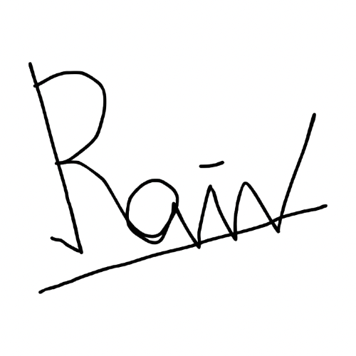

# Deklarasi Penggunaan AI

## Tugas Besar IF2150 - Rekayasa Perangkat Lunak

| Informasi | Keterangan |
|---|---|
| Kelas | *K2* |
| Nomor Kelompok | *5* |
| Nama Kelompok | *Join yang mau* |
| Nama Perangkat Lunak | *EcoTrack* |

**Anggota Kelompok:**

| NIM | Nama |
|---|---|
| *13525038* | *Mochammad Adhitya Nur Rohman* |
| *13525068* | *Kelvin Sebastian Yen* |
| *13525086* | *Arla Salsabila* |
| *13525137* | *Maharani Puan Satira* |
| *13525146* | *Muhammad Reffah* |

---

### Daftar Isi
* [Milestone 1](#milestone-1)
* Notes: Copy bagian Daftar Isi seperti Milestone 1 untuk Milestone berikutnya, contoh ``* [Milestone 2](#milestone-2)``. Ketika Daftar isi diklik maka akan langsung diarahkan ke bagian bawah sesuai dengan Milestone tujuan.

---

### Log Penggunaan AI per Milestone

Silakan catat penggunaan AI yang berdampak signifikan pada pengerjaan tugas (misal: *generate* fungsi algoritma yang kompleks, *generate* draf dokumen SKPL/DPPL, atau *debugging* error utama). 
*Penggunaan sepele seperti memperbaiki *typo* atau auto-complete satu baris kode tidak perlu dicatat.*

### Milestone 1
| Tool AI | Tujuan Penggunaan | Contoh Prompt Utama | Modifikasi & Validasi Manusia |
| :--- | :--- | :--- | :--- |
| *ChatGPT* | *Brainstorming ide nama perangkat lunak* | *Tolong berikan saran nama perangkat lunak untuk perangkat lunak tentang pengelolaan sampah* | *AI memberikan beberapa saran nama perangkat lunak dan setelah kami berdiskusi, kami memilih nama EcoTrack.* |
| | | | | |

### Milestone 2
| Tool AI | Tujuan Penggunaan | Contoh Prompt Utama | Modifikasi & Validasi Manusia |
| :--- | :--- | :--- | :--- |
| | | | | |
| | | | | |

---
### Pernyataan Integritas dan Persetujuan

Kami yang bertanda tangan di bawah ini menyatakan bahwa seluruh log penggunaan AI di atas adalah benar. Kami telah memvalidasi seluruh hasil AI dan bertanggung jawab penuh atas orisinalitas, keamanan, dan kebenaran hasil akhir dari tugas ini.

| Tanda Tangan | Nama Anggota |
| :---: | :--- |
|  | **[NIM - Nama Anggota 1]** |
|  | **[NIM - Nama Anggota 2]** |
|  | **[NIM - Nama Anggota 3]** |
|  | **[NIM - Nama Anggota 4]** |
|  | **[NIM - Nama Anggota 5]** |