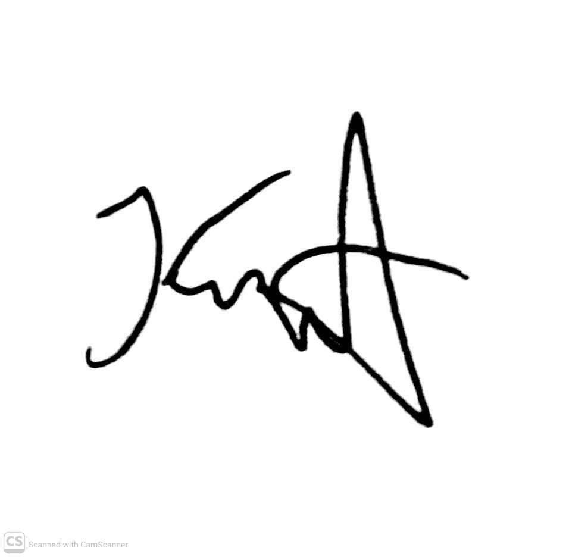
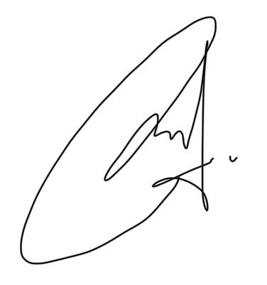
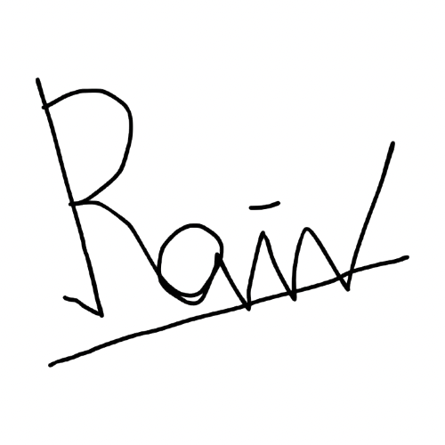
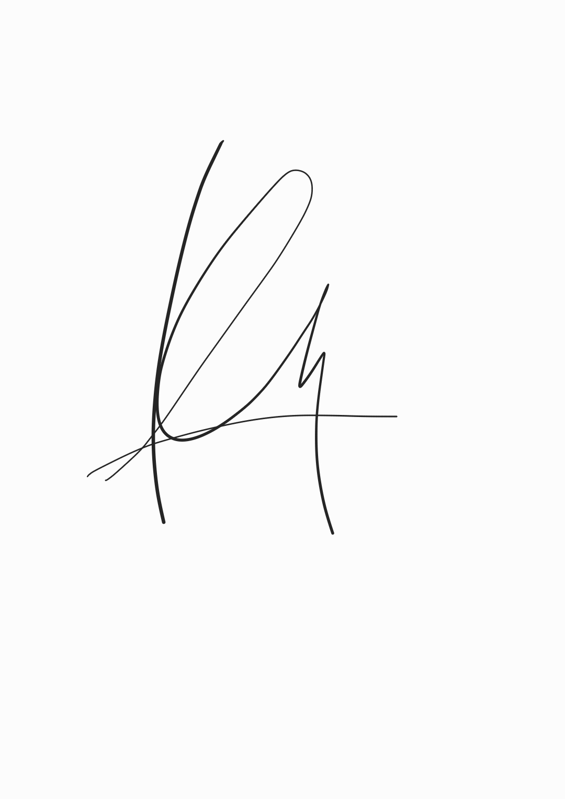

# Deklarasi Penggunaan AI

## Tugas Besar IF2150 - Rekayasa Perangkat Lunak

| Informasi | Keterangan |
|---|---|
| Kelas | K2 |
| Nomor Kelompok | 5 |
| Nama Kelompok | Join yang mau |
| Nama Perangkat Lunak | EcoTrack |

**Anggota Kelompok:**

| NIM | Nama |
|---|---|
| 13525038 | Mochammad Adhitya Nur Rohman |
| 13525068 | Kelvin Sebastian Yen |
| 13525086 | Arla Salsabila |
| 13525137 | Maharani Puan Satira |
| 13525146 | Muhammad Reffah |

---

### Daftar Isi
* [Milestone 1](#milestone-1)
* [Milestone 2](#milestone-2) 
* [Milestone 3](#milestone-3) 
* [Milestone 4](#milestone-4) 
* Notes: Copy bagian Daftar Isi seperti Milestone 1 untuk Milestone berikutnya, contoh ``* [Milestone 2](#milestone-2)``. Ketika Daftar isi diklik maka akan langsung diarahkan ke bagian bawah sesuai dengan Milestone tujuan.

---

### Log Penggunaan AI per Milestone

Silakan catat penggunaan AI yang berdampak signifikan pada pengerjaan tugas (misal: *generate* fungsi algoritma yang kompleks, *generate* draf dokumen SKPL/DPPL, atau *debugging* error utama). 
*Penggunaan sepele seperti memperbaiki *typo* atau auto-complete satu baris kode tidak perlu dicatat.*

### Milestone 1
| Tool AI | Tujuan Penggunaan | Contoh Prompt Utama | Modifikasi & Validasi Manusia |
| :--- | :--- | :--- | :--- |
| ChatGPT | Brainstorming ide nama perangkat lunak | Tolong berikan saran nama perangkat lunak untuk perangkat lunak tentang pengelolaan sampah | AI memberikan beberapa saran nama perangkat lunak dan setelah kami berdiskusi, kami memilih nama EcoTrack. |

### Milestone 2
| Tool AI | Tujuan Penggunaan | Contoh Prompt Utama | Modifikasi & Validasi Manusia |
| :--- | :--- | :--- | :--- |
| ChatGPT | Konsultasi bagian Pemetaan Kebutuhan terutama bagian sistem | Bantu aku perbaiki terutama sisi sistem, seperti sistem apa yang harus diaplikasikan untuk mencapai yang bagian *User* | Setelah berkonsultasi bersama asisten bersama teman-teman, akhirnya bagian sistem sudah dibenarkan. Jawaban dari AI tidak jadi dipakai. |

### Milestone 3
| Tool AI | Tujuan Penggunaan | Contoh Prompt Utama | Modifikasi & Validasi Manusia |
| :--- | :--- | :--- | :--- |
| - | - | - | - |

### Milestone 4
| Tool AI | Tujuan Penggunaan | Contoh Prompt Utama | Modifikasi & Validasi Manusia |
| :--- | :--- | :--- | :--- |
| Claude | Validasi diagram kelas, atribut, dan metode | Permisi Claude, tolong bantu cek diagram kelas, atribut, dan metode yang sudah aku bikin. | Jawaban dari AI divalidasi dengan cara berkonsultasi dengan asisten. |

### Milestone 5
| Tool AI | Tujuan Penggunaan | Contoh Prompt Utama | Modifikasi & Validasi Manusia |
| :--- | :--- | :--- | :--- |
| ChatGPT | Mengarahkan jawaban | Tolong lengkapi bagian 2.4 yaitu (Ini contoh) 2.4 Batasan Perangkat Lunak: Batasan yang harus dituliskan, di antaranya: 1. P/L harus memakai file data/API dari sistem lain (sebutkan, misal Payment Gateway dummy). 2. P/L harus memakai format data yang sama dengan sistem lain.3. P/L harus berfungsi pada platform tertentu (misal: web browser modern, atau desktop Windows dan Linux). ... | Awalnya melihat jawaban AI, tetapi setelah pertimbangan hasil diskusi dengan anggota kelompok, ada beberapa poin yang jawaban manusia, AI hanya memperbaiki struktur kalimat.|

### Milestone 6
| Tool AI | Tujuan Penggunaan | Contoh Prompt Utama | Modifikasi & Validasi Manusia |
| :--- | :--- | :--- | :--- |
| ChatGPT | Mengarahkan jawaban | Tolong bantuan untuk BAB 1: Style/Pattern Arsitektur Acuan menyesuaikan dengan konten yang di SKPL | AI hanya untuk meluruskan pemahaman, jawaban akhir diperbaiki dengan asistensi dan berdiskusi di grup. |

---
### Pernyataan Integritas dan Persetujuan

Kami yang bertanda tangan di bawah ini menyatakan bahwa seluruh log penggunaan AI di atas adalah benar. Kami telah memvalidasi seluruh hasil AI dan bertanggung jawab penuh atas orisinalitas, keamanan, dan kebenaran hasil akhir dari tugas ini.

| Tanda Tangan | Nama Anggota |
| :---: | :--- |
|  | **[13525038 - Mochammad Adhitya Nur Rohman]** |
|  | **[13525068 - Kelvin Sebastian Yen]** |
|  | **[13525086 - Arla Salsabila]** |
|  | **[13525137 - Maharani Puan Satira]** |
|  | **[13525146 - Muhammad Reffah]** |
