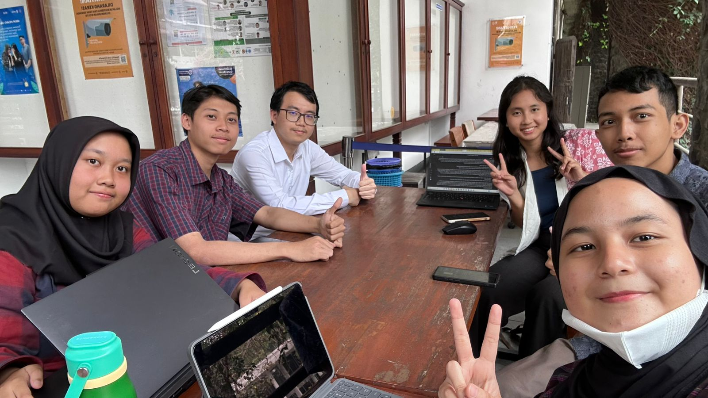

# Form Asistensi

## Tugas Besar IF2150 - Rekayasa Perangkat Lunak

| Informasi | Keterangan |
| --- | --- |
| **Hari** | Senin |
| **Tanggal** | 31/08/2026 |
| **Kelas** | K2 |
| **Nomor Kelompok** | 5  |
| **Nama Kelompok** | Join yang mau  |
| **Nama Perangkat Lunak** | EcoTrack |
| **Dokumen** | K02_G05_Final_TB.md  |

### Anggota Kelompok

| NIM | Nama |
| --- | --- |
| 13525038 | Mochammad Adhitya Nur Rohman |
| 13525068 | Kelvin Sebastian Yen |
| 13525086 | Arla Salsabila |
| 13525137 | Maharani Puan Satira |
| 13525146 | Muhammad Reffah |

### Catatan

| Catatan |
| --- |
| 1. Kalau Kutip kasih tau dari mana website  |
| 2. Analisis kondisi saat ini tuh lebih liat masalah sampah di handle nya gimana, dan cari celah kurangnya solusi yang sudah ada. |
| 3. ⁠Kalau terkait update jadwal yang mudah itu manual |
| 4. Batasan: mau OS berapa, tapi gak perlu detail |
| 5. Aktornya ditambahin petugas kebersihan |
| 6. User Story lebih baik dipisah karena ada dua tujuan |
| 7. ⁠Referensi: Buat latar belakang bikin APA |
| 8. Lampiran: bisa buat taro diagram |
| 9. ⁠Batasan produk bisa sekitar Jawa Barat |
| 10. ⁠Deskripsi aktivitas dan model proses gak harus sama jumlahnya |

## Dokumentasi

<!--  -->

  

  <i>Gambar 1. Dokumentasi kegiatan asistensi.</i>

