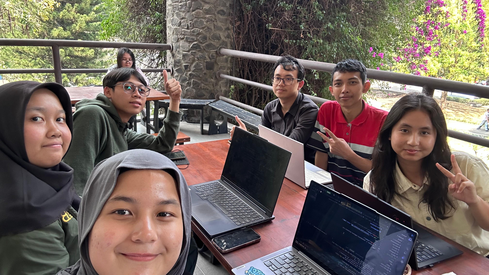

# Form Asistensi

## Tugas Besar IF2150 - Rekayasa Perangkat Lunak

| Informasi | Keterangan |
| --- | --- |
| **Hari** | Senin |
| **Tanggal** | 07/09/2026 |
| **Kelas** | K2 |
| **Nomor Kelompok** | 5  |
| **Nama Kelompok** | Join yang mau |
| **Nama Perangkat Lunak** | EcoTrack |
| **Dokumen** | K02_G05_RG  |

### Anggota Kelompok

| NIM | Nama |
|---|---|
| 13525038 | Mochammad Adhitya Nur Rohman |
| 13525068 | Kelvin Sebastian Yen |
| 13525086 | Arla Salsabila |
| 13525137 | Maharani Puan Satira |
| 13525146 | Muhammad Reffah |

### Catatan

| Catatan |
| --- |
| 1. Bab 1, kebutuhan pengguna awal bisa tinggal copy paste, tapi kalau mau revisi taro di perubahan M2 |
| 2. 2.2 Deskripsi Aktivtias: Memakai SPOK, A01 langsung lakukan ke pemindaian sampah |
| 3. 2.3 Pemetaan kebutuhan berurutan: user, system, legal. Lebih menjabarkan detailnya tapi ga harus sampe detailnya, misal pengguna masuk ke akun, maka butuh login |
| 4. Legal apakah sistem sudah check dengan aturan lingkungan target |
| 5. KNF dan KF itu udah kebutuhan fungsional, F mengacu ke kebutuhannya: lebih general dari kebutuhan biasanya |
| 6. KNF ditulis minimal 5 dan ga perlu semuanya/detail banget |
| 7. Referensi bisa dibagi dua: daftar pustaka (cantumin aturan legalnya) dan lampiran |
| 8. System sinkron dengan masyarakat umum, petugas kebersihan; enskripsi data yang mau dipakai untuk input password, seperti algoritmanya apa ; Notifikasi harus dimasukkin ke kebutuhan dan Functional: jelasin yang diterima; Kalau ada problem di-solve berapa lama; minimal user; website on 24 jam; feedback gak perlu dikasih tau, tapi arsitektur yang diharapkan dari app ini |

## Dokumentasi

<!--  -->

  

  <i>Gambar 1. Dokumentasi kegiatan asistensi.</i>
  

