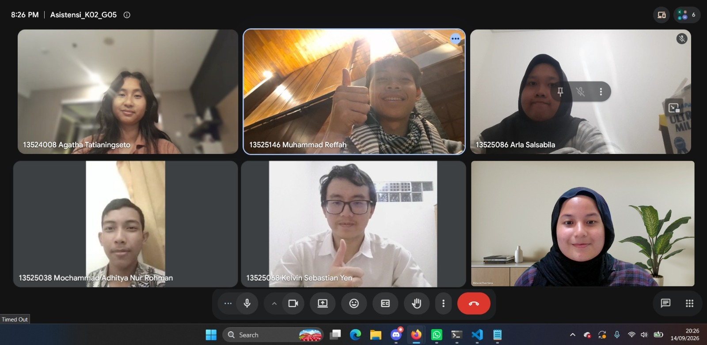

# Form Asistensi

## Tugas Besar IF2150 - Rekayasa Perangkat Lunak

| Informasi | Keterangan |
| --- | --- |
| **Hari** | Senin |
| **Tanggal** | 14/09/2026 |
| **Kelas** | K2 |
| **Nomor Kelompok** | 5  |
| **Nama Kelompok** | Join yang mau |
| **Nama Perangkat Lunak** | EcoTrack |
| **Dokumen** | K02_G05_UC  |

### Anggota Kelompok

| NIM | Nama |
|---|---|
| 13525038 | Mochammad Adhitya Nur Rohman |
| 13525068 | Kelvin Sebastian Yen |
| 13525086 | Arla Salsabila |
| 13525137 | Maharani Puan Satira |
| 13525146 | Muhammad Reffah |

### Catatan

| Catatan |
| --- |
| 1. Terkait kebutuhan fungsional, aktor, copy dari dokumen sebelumnya |
| 2. Consider lagi agar sistem tidak terlalu sederhana, bisa tambahkan status pengambilan, setidaknya 5 atau 6 usecase, bisa tambahin fitur lagi |
| 3. Untuk diagram, boleh memanjang ke bawah agar lebih rapi. Pastikan garis usecase lurus, include dan extendnya juga. Rapi dan mudah terbaca |
| 4. Ketika menuliskan skenario yang berkaitan dengan lebih dari satu aktor, bisa menambahkan kolom aktor agar lebih jelas aktor yang terkait |
| 5. Tidak perlu one on one antara trigger dan reaksi, bisa langsung ada reaksi dari sistem, bisa juga hanya trigger |
| 6. Tidak ada minimal skenario untuk setiap use case |
| 7. Minggu depan akan merancang terkait dengan diagram kelas, saat implementasi juga direkomendasikan menggunakan OOP |

## Dokumentasi

<!--  -->

  

  <i>Gambar 1. Dokumentasi kegiatan asistensi.</i>

