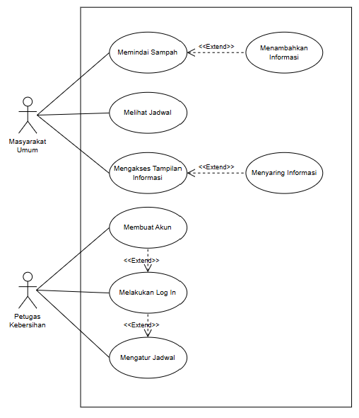
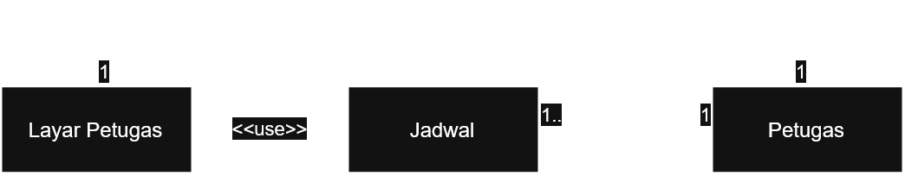
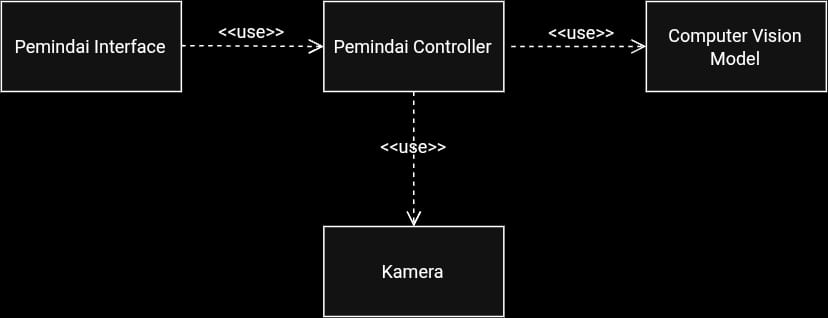
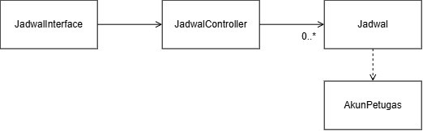
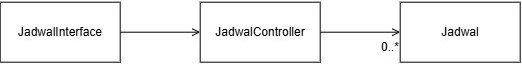
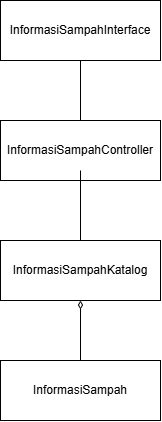
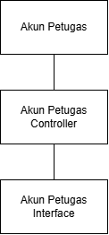

<h1>
IF2150 REKAYASA PERANGKAT LUNAK
 
TUGAS 4
 
CLASS DIAGRAM
</h1>
 

## EcoTrack

### Untuk: Agatha Tatianingseto

Dipersiapkan oleh:
| Informasi | Keterangan |
| --- | --- |
| Kelas | K2 |
| Kelompok | 5 |

| NIM | Nama |
|---|---|
| 13525038 | Mochammad Adhitya Nur Rohman |
| 13525068 | Kelvin Sebastian Yen |
| 13525086 | Arla Salsabila |
| 13525137 | Maharani Puan Satira |
| 13525146 | Muhammad Reffah |
---

## Daftar Perubahan

| Revisi | Deskripsi |
| :--- | :--- |
| A | Bab 3 *Use Case Diagram* direvisi dengan menambahkan garis penghubung antar Menambahkan Informasi dan Menyaring Informasi dengan Masyarakat Umum dan implementasikan generalisasi Petugas Kebersihan ke Masyarakat Umum. |
| B | Bab 3.4.3 direvisi dengan menambahkan alternatif skenario, yaitu menambahkan dan menghapus jadwal. |
| C | KF05 direvisi dengan menambahkan penghapusan jadwal oleh petugas. |
| D | KF07 ditambahkan pada UC05|

 
 

# BAB 1: Deskripsi Perangkat Lunak

EcoTrack adalah sebuah sistem aplikasi perangkat lunak berbasis mobile yang dirancang untuk mengatasi isu tentang sampah. Aplikasi ini digunakan untuk mengidentifikasi jenis sampah secara praktis serta penghubung antara masyarakat dengan petugas kebersihan. Alur kerja sistem dibagi menjadi dua berdasarkan penggunanya. Bagi masyarakat, alur kerja dimulai dengan pengguna memindai sampah menggunakan perangkat mobile. Setelah itu, sistem akan mengidentifikasi jenis sampah tersebut dan menampilkan informasi terkait metode daur ulang yang dapat dilakukan. Sementara itu, bagi petugas kebersihan, alur kerjanya meliputi memasukkan, mengubah, dan mengelola jadwal pengambilan sampah. Jadwal yang dimasukkan oleh petugas ini kemudian akan ditampilkan kepada masyarakat secara konsisten. 

Harapan dari penerapan solusi ini adalah untuk memberikan kemudahan bagi masyarakat agar tidak kebingungan saat memilah sampah, sekaligus mempermudah pekerjaan petugas kebersihan agar tidak perlu memilah kembali sampah yang salah dikelompokkan. Secara jangka panjang, sistem ini diharapkan dapat meningkatkan pemahaman masyarakat dan mendorong perubahan perilaku yang berkelanjutan terkait daur ulang dan pemilahan sampah.  

---

# BAB 2: Kebutuhan Fungsional

## 2.1 Kebutuhan Fungsional

| ID KF | ID Kebutuhan | Penjelasan |
| :--- | :--- | :--- |
| *KF01* | *R01* | *PL dapat menggunakan kamera setelah menyetujui akses aplikasi terkait penggunaan kamera* |
| *KF02* | *R01* | *PL dapat melakukan request ke API model computer vision setelah pengguna menyorot sampah melalui kamera* |
| *KF03* | *R03* | *PL dapat mengirimkan query jadwal pengambilan sampah setelah pengguna membuka menu cek jadwal* |
| *KF04* | *R03* | *PL dapat menampilkan jadwal pengambilan sampah setelah mendapat respons dari query ke database jadwal pengambilan sampah* |
| *KF05* | *R04* | *PL dapat melakukan query penambahan, perubahan, maupun penghapusan jadwal ke database setelah petugas mengirimkan perubahan* |
| *KF06* | *R05* | *PL dapat menampilkan hasil pemilahan sampah dari respons API model computer vision* |
| *KF07* | *R06* | *PL dapat menampilkan cara mendaur ulang yang sesuai setelah pengguna melakukan search tipe sampah* |
| *KF08* | *R08* | *PL dapat melakukan autentikasi akun terhadap database ketika petugas melakukan login* |
| *KF09* | *R08* | *PL dapat menambahkan akun baru pada database ketika petugas melakukan Register* |

---

# BAB 3: Model Use Case

## 3.1 Identifikasi Aktor

| Aktor | Deskripsi |
| :--- | :--- |
| *Masyarakat Umum* | *Pengguna yang melakukan scan pada sampah dan cek jadwal melalui sistem.* |
| *Petugas* | *Pengguna yang mengupdate jadwal secara berkala pada sistem.* |

## 3.2 Identifikasi Use Case

| ID UC | Nama Use Case | Deskripsi Singkat | Aktor Terlibat | ID KF Terkait |
| :--- | :--- | :--- | :--- | :--- |
| *UC01* | *Melakukan Log In* | *Petugas kebersihan memasukkan kredensial dan masuk ke akunnya di aplikasi* | *Petugas Kebersihan* | *KF08* |
| *UC02* | *Memindai Sampah* | *Masyarakat dapat menggunakan kamera untuk memindai sampah dan mendapatkan informasi terkait jenis sampahnya* | *Masyarakat* | *KF01, KF02, KF06* |
| *UC03* | *Mengatur Jadwal* | *Petugas kebersihan mengatur jadwal di aplikasi sesuai dengan kehendaknya* | *Petugas Kebersihan* | *KF05* |
| *UC04* | *Melihat Jadwal* | *Masyarakat memeriksa jadwal yang sudah ditetapkan oleh petugas kebersihan* | *Masyarakat* | *KF03, KF04* |
| *UC05* | *Mengakses Tampilan Informasi* | *Masyarakat membuka tampilan berisi informasi terkait sampah seperti jenis sampah, contoh sampah, dan cara mendaur ulang sampah* | *Masyarakat* | *KF06, KF07* |
| *UC06* | *Membuat Akun* | *Petugas kebersihan dapat membuat akun menggunakan kredensialnya* | *Petugas Kebersihan* | *KF09* |

## 3.3 Use Case Diagram
 

<i>Gambar 1. Use Case Diagram</i>

 

## 3.4 Skenario Use Case

### 3.4.1 Skenario UC01

**Nama Use Case:** Melakukan Log In

**Skenario Normal**

| No | Aksi Aktor | Reaksi Perangkat Lunak |
| :--- | :--- | :--- |
| 1 | Petugas kebersihan memilih menu profil. | Sistem mengarahkan petugas ke menu profil yang berisi pilihan Log In atau Sign Up. |
| 2 | Petugas memilih pilihan Log In. | Sistem mengarahkan petugas ke halaman Log In dan meminta kredensial akun petugas. |
| 3 | Petugas memasukkan kredensial akunnya dan menekan tombol Log In. | Sistem memverifikasi kredensial pengguna. Lalu sistem menampilkan notifikasi bahwa petugas sudah login dan menampilkan menu profil. |

 

**Skenario Alternatif 1: Otorisasi Log In Akun Gagal**

| No | Aksi Aktor | Reaksi Perangkat Lunak |
| :--- | :--- | :--- |
| 1 | Petugas kebersihan memilih menu profil. | Sistem mengarahkan petugas ke menu profil yang berisi pilihan Log In atau Sign Up. |
| 2 | Petugas memilih pilihan Log In. | Sistem mengarahkan petugas ke halaman Log In dan meminta kredensial akun petugas. |
| 3 | Petugas memasukkan kredensial akun yang salah dan menekan tombol Log In. | Sistem menampilkan pesan "Email atau password salah" dan meminta petugas memasukkan kredensial ulang. |

### 3.4.2 Skenario UC02

**Nama Use Case:** Memindai Sampah

**Skenario Normal**

| No | Aksi Aktor | Reaksi Perangkat Lunak |
| :--- | :--- | :--- |
| 1 | Masyarakat memilih menu pindai sampah. | Sistem mengarahkan masyarakat ke halaman pindai sampah dan membuka kamera HP. |
| 2 | Masyarakat mengarahkan kamera HP ke sampah hingga terlihat dengan jelas. | Sistem memindai sampah lalu memberikan notifikasi. |
| 3 | Masyarakat membuka notifikasi. | Sistem menampilkan kategori sampah dan cara mendaur ulang semua sampah yang terlihat oleh kamera. |

 

**Skenario Alternatif 1: Masyarakat memilih memindai sampah dengan barcode**

| No | Aksi Aktor | Reaksi Perangkat Lunak |
| :--- | :--- | :--- |
| 1 | Masyarakat memilih menu pindai sampah. | Sistem mengarahkan masyarakat ke halaman pindai sampah dan membuka kamera HP. |
| 2 | Masyarakat memilih pilihan pindai dengan barcode. | Sistem mengganti mode menjadi pindai dengan barcode. |
| 3 | Masyarakat mengarahkan kamera HP ke barcode sampah hingga terlihat dengan jelas. | Sistem memindai barcode sampah lalu memberikan notifikasi. |
| 4 | Masyarakat membuka notifikasi. | Sistem menampilkan kategori sampah dan cara mendaur ulang sampah yang terpindai. |

 

**Skenario Alternatif 2: Data barcode sampah tidak ada di database**

| No | Aksi Aktor | Reaksi Perangkat Lunak |
| :--- | :--- | :--- |
| 1 | Masyarakat memilih menu pindai sampah. | Sistem mengarahkan masyarakat ke halaman pindai sampah dan membuka kamera HP. |
| 2 | Masyarakat memilih pilihan pindai dengan barcode. | Sistem mengganti mode menjadi pindai dengan barcode. |
| 3 | Masyarakat mengarahkan kamera HP ke barcode sampah yanag belum ada datanya di database. | Sistem memindai barcode sampah lalu menampilkan notifikasi data belum ada di database. Sistem menampilkan pilihan apakah user mau membantu mendata produk. |
| 4 | Masyarakat memilih pilihan mau. | Sistem mengarahkan masyarakat ke halaman input data dan meminta input berupa detail produk dan kategori sampah. |
| 5 | Masyarakat mengisi input detail produk dan kategori sampah serta menekan tombol "Selesai". | Sistem menerima input dan menambah data tersebut ke database. Setelah itu sistem  memberikan notifikasi bahwa data berhasil ditambah disertai tombol bertulisan "Selesai". |
| 6 | Masyarakat menekan tombol "Selesai". | Sistem mengarahkan masyarakat kembali ke menu pindai sampah. |

 

**Skenario Alternatif 3: Kategori sampah yang ditampilkan salah**

| No | Aksi Aktor | Reaksi Perangkat Lunak |
| :--- | :--- | :--- |
| 1 | Masyarakat memilih menu pindai sampah. | Sistem mengarahkan masyarakat ke halaman pindai sampah dan membuka kamera HP. |
| 2 | Masyarakat memilih pilihan pindai dengan barcode. | Sistem mengganti mode menjadi pindai dengan barcode. |
| 3 | Masyarakat mengarahkan kamera HP ke barcode sampah hingga terlihat dengan jelas. | Sistem memindai barcode sampah lalu memberikan notifikasi. |
| 4 | Masyarakat membuka notifikasi. | Sistem menampilkan kategori sampah yang salah dan cara mendaur ulang sampah yang terpindai. Sistem juga menampilkan pesan "Klik di sini jika kategori sampah salah". |
| 5 | Masyarakat menekan pesan "Klik di sini jika kategori sampah salah". | Sistem mengarahkan masyarakat ke halaman input data dan meminta input berupa kategori sampah yang benar. |
| 6 | Masyarakat mengisi input kategori sampah yang benar lalu menekan tombol "Selesai". | Sistem menerima input dan menambah data tersebut ke database. Setelah itu sistem  memberikan notifikasi bahwa data berhasil diperbarui disertai tombol bertulisan "Selesai". |
| 7 | Masyarakat menekan tombol "Selesai". | Sistem mengarahkan masyarakat kembali ke menu pindai sampah. |

### 3.4.3 Skenario UC03

**Nama Use Case:** Mengatur Jadwal

**Skenario Normal**

| No | Aksi Aktor | Reaksi Perangkat Lunak |
| :--- | :--- | :--- |
| 1 | Petugas kebersihan membuka menu jadwal. | Sistem mengarahkan petugas kebersihan ke halaman jadwal. |
| 2 | Petugas kebersihan mencari tempat pembuangan sampah tempat mereka bekerja. | Sistem menampilkan tempat pembuangan sampah. |
| 3 | Petugas kebersihan menekan tombol edit jadwal. | Sistem mengarahkan petugas kebersihan ke halaman input data dan meminta input berupa jadwal pembuangan sampah terbaru. |
| 4 | Petugas kebersihan memasukkan input jadwal pembuangan sampah terbaru dan menekan tombol "Kirim". | Sistem memperbarui jadwal pembuangan sampah di database dan memberikan notifikasi bahwa data sudah diperbarui disertai tombol bertulisan "Selesai". |
| 5 | Petugas kebersihan menekan tombol "Selesai". | Sistem mengarahkan petugas kembali ke menu jadwal. |

 

**Skenario Alternatif 1: Tempat pembuangan sampah belum terdata**

| No | Aksi Aktor | Reaksi Perangkat Lunak |
| :--- | :--- | :--- |
| 1 | Petugas kebersihan membuka menu jadwal. | Sistem mengarahkan petugas kebersihan ke halaman jadwal. |
| 2 | Petugas kebersihan mencari tempat pembuangan sampah tempat mereka bekerja yang belum terdata. | Sistem menampilkan pesan bahwa data tidak ditemukan. Sistem juga menampilkan pesan "Klik di sini jika ingin menambahkan tempat pembuangan sampah baru". |
| 3 | Petugas kebersihan menekan pesan "Klik di sini jika ingin menambahkan tempat pembuangan sampah baru". | Sistem mengarahkan petugas kebersihan ke halaman input data dan meminta input berupa detail tempat pembuangan sampah tempat dia bekerja. |
| 4 | Petugas kebersihan memasukkan input tempat pembuangan sampah baru dan menekan tombol "Kirim". | Sistem menambahkan tempat pembuangan sampah di database dan memberikan notifikasi bahwa data sudah ditambah disertai tombol bertulisan "Selesai". |
| 5 | Petugas kebersihan menekan tombol "Selesai". | Sistem mengarahkan petugas kembali ke menu jadwal. |

 

**Skenario Alternatif 2: Menambah jadwal pembuangan sampah**

| No | Aksi Aktor | Reaksi Perangkat Lunak |
| :--- | :--- | :--- |
| 1 | Petugas kebersihan membuka menu jadwal. | Sistem mengarahkan petugas kebersihan ke halaman jadwal. |
| 2 | Petugas kebersihan mencari tempat pembuangan sampah tempat mereka bekerja. | Sistem menampilkan tempat pembuangan sampah. |
| 3 | Petugas kebersihan menekan tombol tambah jadwal. | Sistem mengarahkan petugas kebersihan ke halaman input data dan meminta input berupa jadwal pembuangan sampah terbaru. |
| 4 | Petugas kebersihan memasukkan input jadwal pembuangan sampah terbaru dan menekan tombol "Kirim". | Sistem menambah jadwal pembuangan sampah di database dan memberikan notifikasi bahwa data sudah ditambah disertai tombol bertulisan "Selesai". |
| 5 | Petugas kebersihan menekan tombol "Selesai". | Sistem mengarahkan petugas kembali ke menu jadwal. |

 

**Skenario Alternatif 3: Menghapus jadwal pembuangan sampah**

| No | Aksi Aktor | Reaksi Perangkat Lunak |
| :--- | :--- | :--- |
| 1 | Petugas kebersihan membuka menu jadwal. | Sistem mengarahkan petugas kebersihan ke halaman jadwal. |
| 2 | Petugas kebersihan mencari tempat pembuangan sampah tempat mereka bekerja. | Sistem menampilkan tempat pembuangan sampah. |
| 3 | Petugas kebersihan menekan tombol hapus jadwal. | Sistem memberikan notifikasi yang menanyakan apakah petugas kebersihan yakin ingin menghapus jadwal pembuangan sampah ini. |
| 4 | Petugas kebersihan menekan tombol "Yakin". | Sistem menghapus jadwal pembuangan sampah di database dan memberikan notifikasi bahwa data sudah dihapus disertai tombol bertulisan "Selesai". |
| 5 | Petugas kebersihan menekan tombol "Selesai". | Sistem mengarahkan petugas kembali ke menu jadwal. |

 

### 3.4.4 Skenario UC04

**Nama Use Case:** Melihat Jadwal

**Skenario Normal**

| No | Aksi Aktor | Reaksi Perangkat Lunak |
| :--- | :--- | :--- |
| 1 | Masyarakat membuka menu jadwal. | Sistem mengarahkan masyarakat ke menu jadwal dengan berbagai lokasi. |
| 2 | Masyarakat memilih lokasi yang sesuai saat ini. | Sistem mengarahkan masyarakat ke halaman jadwal yang sesuai dengan lokasi tersebut. |

 

**Skenario Alternatif 1: Sistem gagal mengambil jadwal dari database**

| No | Aksi Aktor | Reaksi Perangkat Lunak |
| :--- | :--- | :--- |
| 1 | Masyarakat membuka menu jadwal. | Sistem gagal mengambil data jadwal dari database dalam waktu 20 detik. |
| 2 |  | Sistem menampilkan notifikasi error 504 dan menampilkan tombol refresh |

### 3.4.5 Skenario UC05

**Nama Use Case:** Mengakses Tampilan Informasi

**Skenario Normal**

| No | Aksi Aktor | Reaksi Perangkat Lunak |
| :--- | :--- | :--- |
| 1 | Masyarakat memilih menu tampilan informasi. | Sistem mengarahkan masyarakat ke halaman tampilan informasi. |
| 2 | Masyarakat memilih informasi pemilahan ataupun daur ulang yang ingin dilihat lebih detail. | Sistem menampilkan informasi lebih lanjut yang diinginkan masyarakat. |

 

**Skenario Alternatif 1: Masyarakat menggunakan fitur pencarian**

| No | Aksi Aktor | Reaksi Perangkat Lunak |
| :--- | :--- | :--- |
| 1 | Masyarakat memilih menu tampilan informasi. | Sistem mengarahkan masyarakat ke halaman tampilan informasi. |
| 2 | Masyarakat menekan tombol search dan memasukkan query terkait informasi yang dicari. | Sistem menampilkan informasi yang telah disaring berdasarkan query search. |
| 2 | Masyarakat memilih informasi pemilahan ataupun daur ulang yang ingin dilihat lebih detail. | Sistem menampilkan informasi lebih lanjut yang diinginkan masyarakat |

 

**Skenario Alternatif 2: Sistem gagal mengambil informasi dari database**

| No | Aksi Aktor | Reaksi Perangkat Lunak |
| :--- | :--- | :--- |
| 1 | Masyarakat memilih menu tampilan informasi. | Sistem gagal mengambil data informasi dari database dalam waktu 20 detik. |
| 2 | | Sistem menampilkan notifikasi error 504 dan menampilkan tombol refresh. |

 

### 3.4.6 Skenario UC06

**Nama Use Case:** Membuat Akun

**Skenario Normal**

| No | Aksi Aktor | Reaksi Perangkat Lunak |
| :--- | :--- | :--- |
| 1 | Petugas kebersihan memilih menu profil. | Sistem mengarahkan petugas ke menu profil yang berisi pilihan Log In atau Sign Up. |
| 2 | Petugas memilih pilihan Sign Up. | Sistem mengarahkan petugas ke halaman Sign Up dan meminta kredensial untuk akun petugas. |
| 3 | Petugas memasukkan kredensial akunnya dan menekan tombol Sign Up. | Sistem menampilkan notifikasi bahwa sign up berhasil dan menampilkan menu Log In. |

 

**Skenario Alternatif 1: Akun sudah ada di database**

| No | Aksi Aktor | Reaksi Perangkat Lunak |
| :--- | :--- | :--- |
| 1 | Petugas kebersihan memilih menu profil. | Sistem mengarahkan petugas ke menu profil yang berisi pilihan Log In atau Sign Up. |
| 2 | Petugas memilih pilihan Sign Up. | Sistem mengarahkan petugas ke halaman Sign Up dan meminta kredensial untuk akun petugas. |
| 3 | Petugas memasukkan kredensial akunnya dan menekan tombol Sign Up. | Sistem mendapatkan akun sudah terdaftar di database, kemudian menampilkan notifikasi tersebut kepada petugas. |

 

**Skenario Alternatif 3: Sistem gagal menambahkan informasi ke database**

| No | Aksi Aktor | Reaksi Perangkat Lunak |
| :--- | :--- | :--- |
| 1 | Petugas kebersihan memilih menu profil. | Sistem mengarahkan petugas ke menu profil yang berisi pilihan Log In atau Sign Up. |
| 2 | Petugas memilih pilihan Sign Up. | Sistem mengarahkan petugas ke halaman Sign Up dan meminta kredensial untuk akun petugas. |
| 3 | Petugas memasukkan kredensial akunnya dan menekan tombol Sign Up. | Sistem gagal menambahkan akun ke database dalam 20 detik. |
| 4 |  | Sistem menampilkan notifikasi kegagalan kepada petugas, dan petugas dapat kembali menekan tombol Sign Up. |

# BAB 4: Diagram Kelas

## 4.1 Identifikasi Kelas

| ID Kelas | Nama Kelas | Deskripsi Kelas | ID Use Case |
| :--- | :--- | :--- | :--- |
| *C01* | *Akun Petugas* | *Menyimpan data petugas yang membuat jadwal.* | *UC01, UC06* |
| *C02* | *Akun Petugas Controller* | *Melakukan operasi yang berkaitan dengan akun petugas.* | *UC01, UC03, UC06* |
| *C03* | *Akun Petugas Interface* | *Menampilkan layar login, signup, dan logout petugas.* | *UC01, UC06* |
| *C04* | *Jadwal* | *Menyimpan data jadwal pengambilan sampah.* | *UC03, UC04* |
| *C05* | *Jadwal Controller* | *Melakukan operasi yang berkaitan dengan penjadwalan.* | *UC03, UC04* |
| *C06* | *Jadwal Interface* | *Menampilkan layar jadwal dan pengaturan jadwal.* | *UC03, UC04* |
| *C07* | *Informasi Sampah* | *Menyimpan data informasi sampah dan cara mendaur ulang.* | *UC02, UC05* |
| *C08* | *Informasi Sampah Controller* | *Melakukan operasi yang berkaitan dengan informasi sampah.* | *UC02, UC05* |
| *C09* | *Informasi Sampah Interface* | *Menampilkan layar informasi sampah.* | *UC02, UC05* |
| *C10* | *Informasi Sampah Katalog* | *Mengelompokkan data informasi sampah yang ada.* | *UC02, UC05* |
| *C11* | *Computer Vision Model* | *Antarmuka untuk menggunakan model computer vision.* | *UC02* |
| *C12* | *Kamera* | *Antarmuka untuk mengakses kamera perangkat.* | *UC02* |
| *C13* | *Pemindai Controller* | *Melakukan operasi yang berkaitan dengan aktivitas pemindaian.* | *UC02* |
| *C14* | *Pemindai Interface* | *Menampilkan layar pemindaian sampah.* | *UC02* |

## 4.2 Diagram Kelas per Use Case
Buat diagram kelas untuk setiap use case pada 3.2.

### 4.2.1 Use Case UC01

**Nama Use Case:** *Melakukan Log In*

#### Identifikasi Kelas

| ID Kelas | Nama Kelas | Deskripsi Kelas |
| :--- | :--- | :--- |
| *C01* | *Akun Petugas* | *Menyimpan data petugas yang membuat jadwal.* |
| *C02* | *Akun Petugas Controller* | *Melakukan operasi yang berkaitan dengan akun petugas.* |
| *C03* | *Akun Petugas Interface* | *Menampilkan layar login, signup, dan logout petugas.* |

#### Diagram Kelas

<i>Gambar 2. Diagram Kelas Use Case UC01</i>

 

Pada diagram kelas, cukup tampilkan nama kelas saja. Atribut dan metode/operasi milik setiap kelas dapat dituliskan pada tabel di bawah ini. Pastikan hubungan antarkelas menggunakan jenis relasi yang sesuai (asosiasi, agregasi, komposisi, generalisasi, atau dependensi).

| ID Kelas | Nama Kelas | Atribut | Metode/Operasi |
| :--- | :--- | :--- | :--- |
| *C01* | *Akun Petugas* | *#username, #password, -idPetugas* | *+getUsername(), -cekUsername(), cekPassword()* |
| *C02* | *Akun Petugas Controller* | *-statusLogin* | *+prosesLogin(), +validasiLogin(), +logout()* |
| *C03* | *Akun Petugas Interface* | *-usernameInput, -passwordInput, #pesanStatus* | *+showTampilan(), +showLogin(), +showPesan(), -clearInput()* |

> Lanjutkan pola **4.2.x** untuk setiap use case pada 3.2.

### 4.2.2 Use Case UC02
**Nama Use Case:** *Memindai Sampah*

#### Identifikasi Kelas

| ID Kelas | Nama Kelas | Deskripsi Kelas |
| :--- | :--- | :--- |
| *C11* | *Computer Vision Model* | *Antarmuka untuk menggunakan model computer vision.* |
| *C12* | *Kamera* | *Antarmuka untuk mengakses kamera perangkat.* |
| *C13* | *Pemindai Controller* | *Melakukan operasi yang berkaitan dengan aktivitas pemindaian.* |
| *C14* | *Pemindai Interface* | *Menampilkan layar pemindaian sampah.* |

#### Diagram Kelas

<i>Gambar 3. Diagram Kelas Use Case UC02</i>

 

Pada diagram kelas, cukup tampilkan nama kelas saja. Atribut dan metode/operasi milik setiap kelas dapat dituliskan pada tabel di bawah ini. Pastikan hubungan antarkelas menggunakan jenis relasi yang sesuai (asosiasi, agregasi, komposisi, generalisasi, atau dependensi).

| ID Kelas | Nama Kelas | Atribut | Metode/Operasi |
| :--- | :--- | :--- | :--- |
| *C11* | *Computer Vision Model* | *-labelSampah, -confidenceThreshold* | *+identifikasiSampah()* |
| *C12* | *Kamera* | *-statusKamera* | *+openKamera(), +ambilFrame(), +closeKamera()* |
| *C13* | *Pemindai Controller* | *-isScanning, -hasilIdentifikasi* | *+startPemindaian(), +prosesFrame(), +stopPemindaian()* |
| *C14* | *Pemindai Interface* | *-viewKamera, -overlayBox, -labelJenisSampah* | *+showLiveFeed(), +showJenis()* |

### 4.2.3 Use Case UC03
**Nama Use Case:** Mengatur jadwal

#### Identifikasi Kelas

| ID Kelas | Nama Kelas | Deskripsi Kelas |
| :--- | :--- | :--- |
| C06 | JadwalInterface | Menampilkan layar jadwal dan pengaturan jadwal. |
| C05 | JadwalController | Melakukan operasi yang berkaitan dengan penjadwalan. |
| C04 | Jadwal | Menyimpan data jadwal pengambilan sampah. |
| C01 | AkunPetugas | Menyimpan data petugas yang membuat jadwal. |

#### Diagram Kelas

<i>Gambar 4. Diagram Kelas Use Case UC03</i>

 

| ID Kelas | Nama Kelas | Atribut | Metode/Operasi |
| :--- | :--- | :--- | :--- |
| C06 | JadwalInterface | - | +showHalamanJadwal(), +showPencarianLokasiTPS(), +showDaftarLokasiTPS(), +showFormJadwal(), +showFormLokasiTPS(), +showNotifikasi(), +showKonfirmasiHapus() |
| C05 | JadwalController | -daftarJadwal | +cariLokasiTPS(), +getDaftarKecamatan(), +getDaftarKelurahan(), +addJadwal(), +editJadwal(), +removeJadwal(), +addLokasiTPS() |
| C04 | Jadwal | -idJadwal, -tanggal, -kecamatan, -kelurahan | +getIdJadwal(), +getTanggal(), +getKecamatan(), +getKelurahan(), +setTanggal(), +setKecamatan(), +setKelurahan() |
| C01 | AkunPetugas | -statusLogin | +cekStatusLogin() |

### 4.2.4 Use Case UC04
**Nama Use Case:** Melihat jadwal

#### Identifikasi Kelas

| ID Kelas | Nama Kelas | Deskripsi Kelas |
| :--- | :--- | :--- |
| C06 | JadwalInterface | Menampilkan layar jadwal dan pengaturan jadwal. |
| C05 | JadwalController | Melakukan operasi yang berkaitan dengan penjadwalan. |
| C04 | Jadwal | Menyimpan data jadwal pengambilan sampah. |

#### Diagram Kelas

<i>Gambar 5. Diagram Kelas Use Case UC04</i>

 

| ID Kelas | Nama Kelas | Atribut | Metode/Operasi |
| :--- | :--- | :--- | :--- |
| C06 | JadwalInterface | - | +showHalamanJadwal(), +showPencarianLokasiTPS(), +showDaftarLokasiTPS(), +showJadwal(), +showNotifikasi(), +refresh() |
| C05 | JadwalController | -daftarJadwal | +cariLokasiTPS(), +getDaftarKecamatan(), +getDaftarKelurahan(), +getJadwal() |
| C04 | Jadwal | -idJadwal, -tanggal, -kecamatan, -kelurahan | +getIdJadwal(), +getTanggal(), +getKecamatan(), +getKelurahan() |

### 4.2.5 Use Case UC05

#### Identifikasi Kelas

**Nama Use Case:** Mengakses Tampilan Informasi

| ID Kelas | Nama Kelas | Deskripsi Kelas |
| :--- | :--- | :--- |
| *C06* | *InterfaceInformasi* | *Menampilkan halaman informasi kepada pengguna dan menerima input pengguna.* |
| *C01* | *InformasiController* | *Menerima input dari interface, mencari informasi dengan bantuan katalog.* |
| *C04* | *KatalogInformasi* | *Menyaring informasi berdasarkan filter yang ada.* |
| *C01* | *Informasi* | *Menyimpan data terkait sampah.* |

#### Diagram Kelas

<i>Gambar 6. Diagram Kelas Use Case UC05</i>

 

| ID Kelas | Nama Kelas | Atribut | Metode/Operasi |
| :--- | :--- | :--- | :--- |
| *C01* | *InterfaceInformasi* | | +showMain(), +showDetail(id), +showSearch(list), +showError(kode) |
| *C04* | *InformasiController* | | +getMain(), +getDetail(id) |
| *C06* | *KatalogInformasi* | |+getMain(), +getDetail(id), +cariInformasi(query) |
| *C06* | *Informasi* | -id: String, -judul: String, -deskripsi: String | +getDetail(id) |

### 4.2.6 Use Case UC06

#### Identifikasi Kelas

**Nama Use Case:** Membuat Akun

| ID Kelas | Nama Kelas | Deskripsi Kelas |
| :--- | :--- | :--- |
| *C01* | *Petugas* | *Menyimpan data petugas yang membuat jadwal.* |
| *C04* | *Database Ecotrack* | *Antarmuka untuk mengakses database jadwal dan akun ecotrack di database.* |
| *C06* | *Layar Petugas* | *Antarmuka petugas dengan aplikasi.* |

#### Diagram Kelas

<i>Gambar 7. Diagram Kelas Use Case UC06</i>

 

| ID Kelas | Nama Kelas | Atribut | Metode/Operasi |
| :--- | :--- | :--- | :--- |
| *C01* | *Petugas* | idPetugas, nama, email, password | login(), logout() |
| *C04* | *Database Ecotrack* | dataPetugas | simpanData(), ambilData(), hapusData(), ubahDaya() |
| *C06* | *Layar Petugas* | | |

## 4.3 Diagram Kelas Keseluruhan

Gabungkan seluruh kelas dan hubungan antarkelas dari diagram kelas setiap use case menjadi satu diagram kelas keseluruhan. Pastikan tidak ada kelas yang terduplikasi.

<i>Gambar X. Diagram Kelas Keseluruhan</i>

 

| ID Kelas | Nama Kelas | Atribut | Metode/Operasi |
| :--- | :--- | :--- | :--- |
| *C01* | *Pelanggan* | *idPelanggan, nama, email* | *lihatRiwayatPesanan()* |
| *C02* | *Pesanan* | *idPesanan, total, status* | *hitungTotal(), perbaruiStatus()* |
| *C03* | *Keranjang* | *daftarItem* | *tambahItem(), checkout()* |
| *C04* | *MetodePembayaran* | *-* | *kirimKePaymentGatewayDummy()* |
| *C05* | *Kartu* | *nomorKartu, masaBerlaku* | *kirimKePaymentGatewayDummy()* |
| *C06* | *EWallet* | *saldo, idAkun* | *cekSaldo(), kirimKePaymentGatewayDummy()* |
| *C07* | *RiwayatTransaksi* | *idTransaksi, waktu, status* | *catatTransaksi(), tampilkanNotifikasi()* |
| *...* | *...* | *...* | *...* |

---

# BAB 5: Traceability
Cocokkan setiap kebutuhan fungsional, use case, dengan diagram kelas yang mendukung atau mengimplementasikan kebutuhan tersebut.

| ID Kelas | ID Use Case | ID KF |
| :--- | :--- | :--- |
| *C01* | *UC01, UC06* | *KF08, KF09, * |
| *C02* | *UC01, UC03, UC06* | *KF05, KF08, KF09* |
| *C03* | *UC01, UC06* | *KF08, KF09* |
| *C04* | *UC03, UC04* | *KF03, KF04, KF05* |
| *C05* | *UC03, UC04* | *KF03, KF04, KF05* |
| *C06* | *UC03, UC04* | *KF03, KF04, KF05* |
| *C07* | *UC02, UC05* | *KF01, KF02, KF06, KF07* |
| *C08* | *UC02, UC05* | *KF01, KF02, KF06, KF07* |
| *C09* | *UC02, UC05* | *KF01, KF02, KF06, KF07* |
| *C10* | *UC02, UC05* | *KF01, KF02, KF06, KF07* |
| *C11* | *UC02* | *KF01, KF02, KF06* |
| *C12* | *UC02* | *KF01, KF02, KF06* |
| *C13* | *UC02* | *KF01, KF02, KF06* |
| *C14* | *UC02* | *KF01, KF02, KF06* |

---

# Referensi

- Diagram UML: [https://www.drawio.com/](https://www.drawio.com/), [https://staruml.io/](https://staruml.io/)
