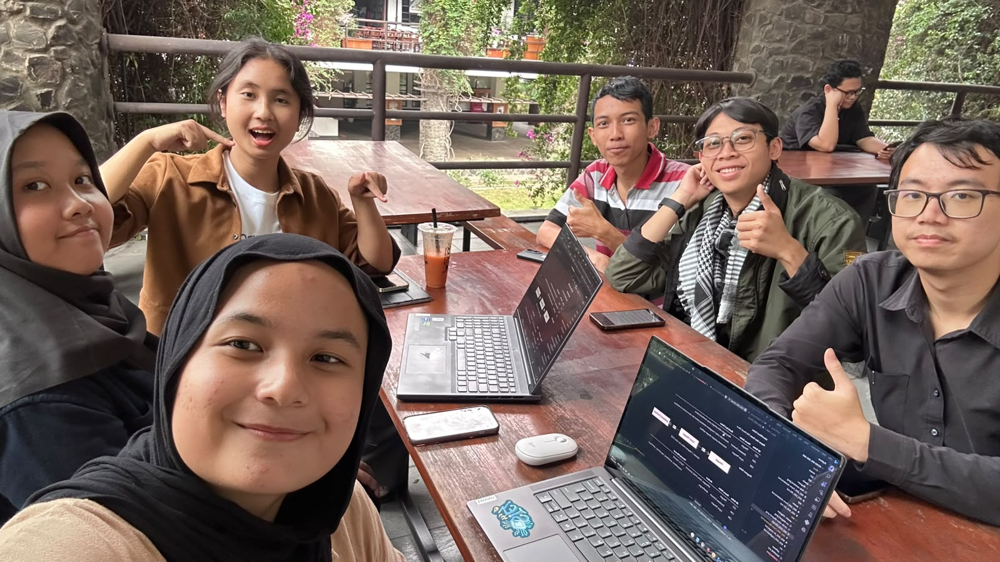

# Form Asistensi

## Tugas Besar IF2150 - Rekayasa Perangkat Lunak

| Informasi | Keterangan |
| --- | --- |
| **Hari** | Senin |
| **Tanggal** | 21/09/2026 |
| **Kelas** | K2 |
| **Nomor Kelompok** | 5  |
| **Nama Kelompok** | Join yang mau |
| **Nama Perangkat Lunak** | EcoTrack |
| **Dokumen** | K02_G05_CD  |

### Anggota Kelompok

| NIM | Nama |
|---|---|
| 13525038 | Mochammad Adhitya Nur Rohman |
| 13525068 | Kelvin Sebastian Yen |
| 13525086 | Arla Salsabila |
| 13525137 | Maharani Puan Satira |
| 13525146 | Muhammad Reffah |

### Catatan

| Catatan |
| --- |
| 1. Diagram use case, yang menambahkan dan menyaring informasi disambung ke masyarakat umum. Fitur yang bisa diakses masyarakat umum juga harus disambungin ke petugas kebersihan. Dibikin generalisasi, jadi ada aktor yang mencakup semuanya: masyarakat umum dan petugas kebersihan.  |
| 2. Identifikasi kelas kan ada yang identity, boundary, interface, dll: Identifikasi juga di kelasnya wether termasuk identity/boundary/controller atau apa. C04: Database jadwal termasuk controller jadwal. Database gak perlu karena sebenarnya controller bagian jadwal dan petugas. Layar petugas & pengguna gak perlu jadi lebih ke interface pengguna dan petugas. C08: bila menyimpan data jenis sampah kan perbarui setiap input, apakah page daur ulang juga terbarui? |
| 3. 4.2.6: Interface (showProfile(), dll -> umumnya show). Karena UC06 itu digabung aja karena emang saling nyatu. Metode/Operasi = public, protective, private -> Identifikasi sistem aksesnya. UI atributnya gak ada tapi metode operasinya ada. Entity itu biasanya get, UI itu show. |

## Dokumentasi

<!--  -->

  

  <i>Gambar 1. Dokumentasi kegiatan asistensi.</i>

