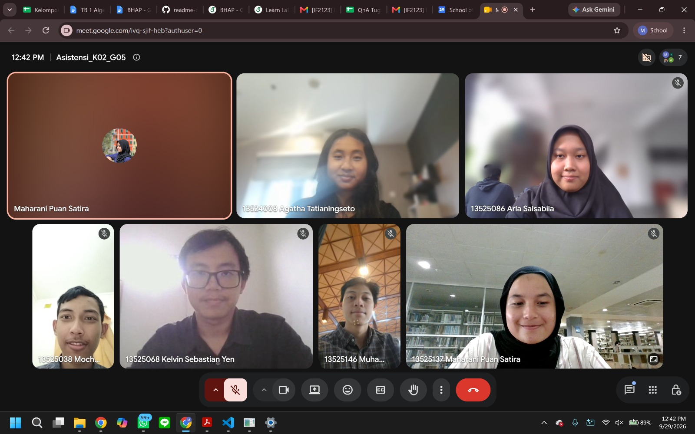

# Form Asistensi

## Tugas Besar IF2150 - Rekayasa Perangkat Lunak

| Informasi | Keterangan |
| --- | --- |
| **Hari** | Senin |
| **Tanggal** | 29/09/2026 |
| **Kelas** | K2 |
| **Nomor Kelompok** | 5  |
| **Nama Kelompok** | Join yang mau |
| **Nama Perangkat Lunak** | EcoTrack |
| **Dokumen** | K02_G05_SKPL  |

### Anggota Kelompok

| NIM | Nama |
|---|---|
| 13525038 | Mochammad Adhitya Nur Rohman |
| 13525068 | Kelvin Sebastian Yen |
| 13525086 | Arla Salsabila |
| 13525137 | Maharani Puan Satira |
| 13525146 | Muhammad Reffah |

### Catatan

| Catatan |
| --- |
| 1. Harusnya akses kamera gaperlu kelas sendiri karena bakal masuk ke sistem perangkat keras. Kalau bisa masing2 kelas gak tumpang tindih dan ada yg bermakna, bukan sekadar jembatan. Identifikasi lagi yang C11-C14 supaya kamera dan pemindai interface gak janggal? CV Model kan sbg pemindai jenis sampah maka deskripsinya harusnya bukan Interface karena kan logicnya. |
| 2. ⁠Sedikit saran: gak saranin train di local, CV model ga perlu dibutuhin, lebih ke pemindai controller aja. Kamera juga apakah cuman sbg perizinan di HP atau gimana coba pikirin hehe. |
| 3. ⁠Sampah katalog itu kan ada fitur search jd lebih nge filter informasi itu. Katalog dan controller digabung aja. Kalau contoh katalog itu yang database nya besar banget (misal rownya jutaan) kalau kecil mah yaudah gapapa |
| 4. ⁠Usahain kalau diagram kelas keseluruhan harusnya entity nya aja. AkunPetugas -  PemindaiController harusnya bisa karena bisa ngelakuin/melihat call function dr pemindai controller. |
| 5. ⁠Entity controller interface pake asosiasi biasa aja (garis solid lurus). |
| 6. ⁠Jadwal bergantung AkunPetugas (panah garis biasa aja) |
| 7. ⁠Pemindai dan InformasiSampah itu cukup pakai asosiasi, tentuin aja dari 1…n (berapa tentuin) |

## Dokumentasi

<!--  -->

  

  <i>Gambar 1. Dokumentasi kegiatan asistensi.</i>

