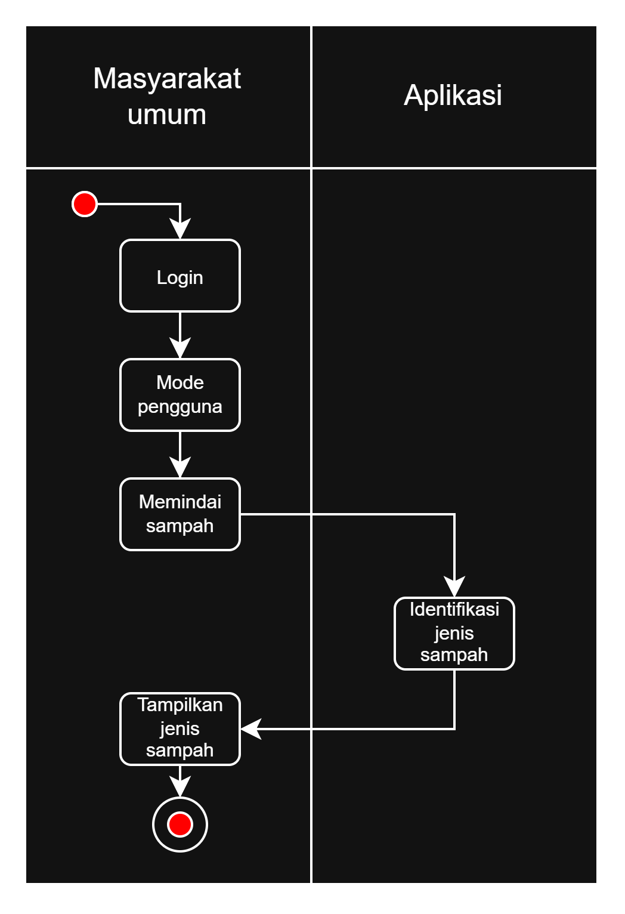
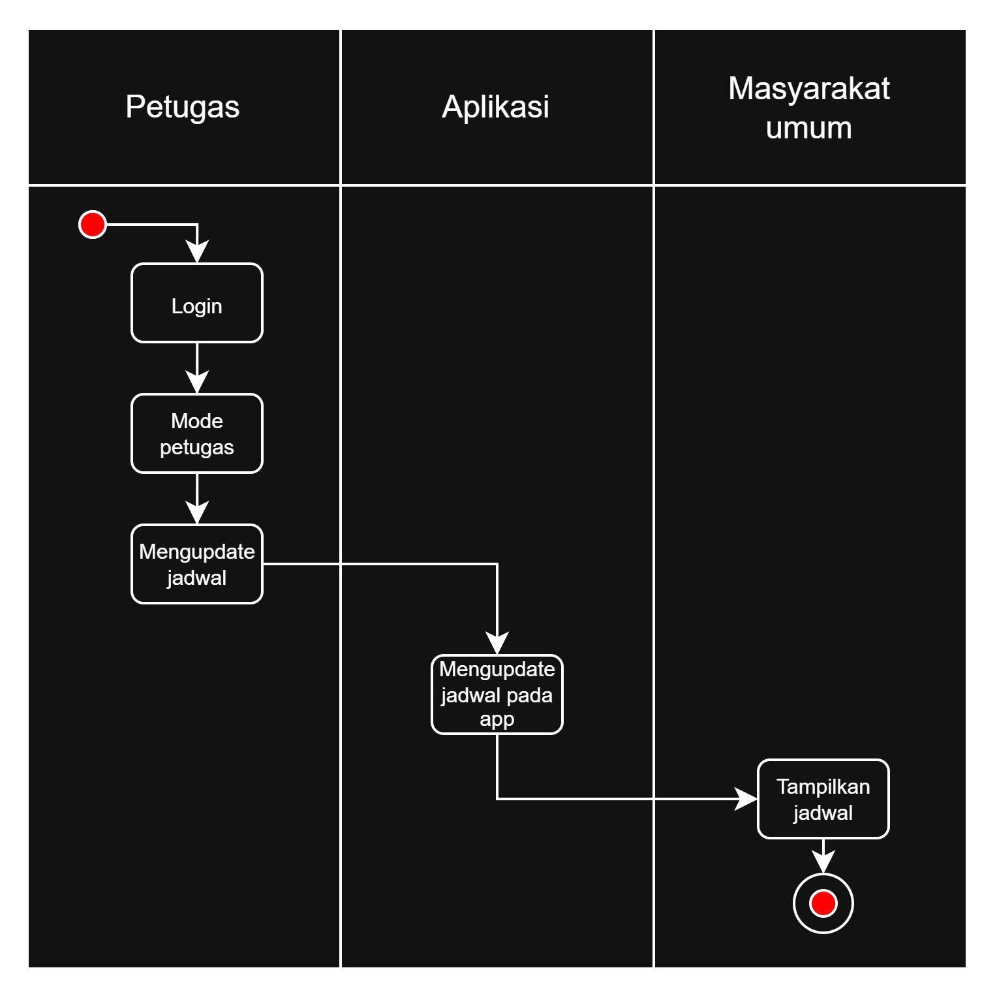
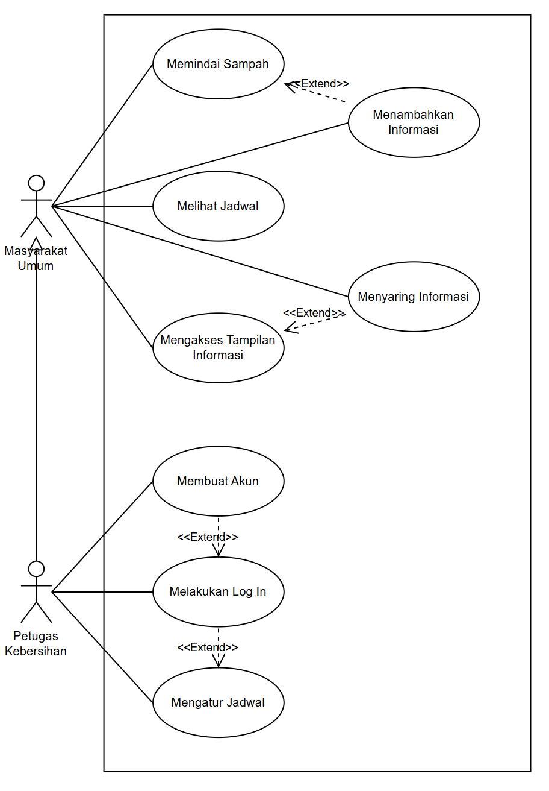
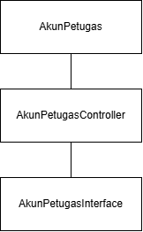
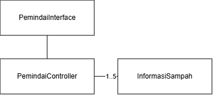
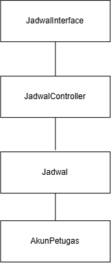
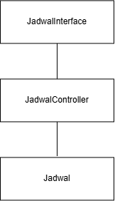
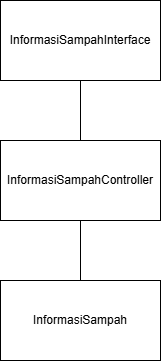
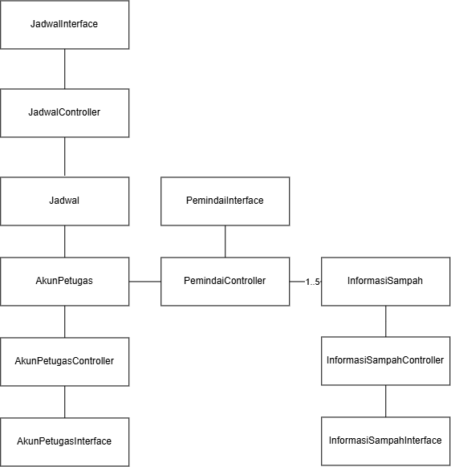

<h1>
IF2150 REKAYASA PERANGKAT LUNAK
 
TUGAS 5
 
SPESIFIKASI KEBUTUHAN PERANGKAT LUNAK (SKPL)
</h1>
 

## EcoTrack

### Untuk: Agatha Tatianingseto

Dipersiapkan oleh:
| Informasi | Keterangan |
| --- | --- |
| Kelas | K2 |
| Kelompok | 5 |

| NIM | Nama |
|---|---|
| 13525038 | Mochammad Adhitya Nur Rohman |
| 13525068 | Kelvin Sebastian Yen |
| 13525086 | Arla Salsabila |
| 13525137 | Maharani Puan Satira |
| 13525146 | Muhammad Reffah |
---

## Daftar Perubahan

| Revisi | Deskripsi |
| :--- | :--- |
| *A* | *Menghapus kelas CV model dan kamera dan menggabungkan atribut/metode yang relevan pada kelas yang sesuai* |
| *B* |  |
| *C* |  |
| ... |  |

 

# BAB 1: Pendahuluan

## 1.1 Tujuan Penulisan Dokumen
Dokumen SKPL ditulis dengan tujuan menciptakan suatu dokumen penghubung antara pengembang dan pengguna perangkat lunak. Tidak dapat dipungkiri bahwa dalam pengembangan perangkat lunak, terdapat banyak masalah yang menghambat proses pengembangan, termasuk tapi tidak terbatas pada konflik kepentingan, tuntutan kontrak, dan pemahaman yang berbeda. Aplikasi EcoTrack sendiri tidak terlepas dari masalah ini, mengingat kompleksitas sistem yang dirancang dan akan dibangun. Oleh karena itu, diharapkan bahwa penulisan dokumen ini akan menghilangkan ambiguitas, mencegah miskomunikasi, dan menghasilkan perangkat lunak yang sesuai kebutuhan dan mudah dirawat.

Pengguna dokumen ini mencakup sejumlah pihak yang terlibat dalam proses pengembangan perangkat lunak. Pertama, dokumen ini akan digunakan oleh pengembang awal dan pengembang yang akan datang sebagai acuan kesesuaian spesifikasi dalam pengembangan dan perawatan lanjut. Kedua, dokumen ini menjadi standar untuk memverifikasi kesesuaian fungsionalitas perangkat lunak bagi penguji/evaluator. Ketiga, klien yang merupakan pemangku kepentingan dapat mengacu pada dokumen ini untuk memastikan kebutuhannya telah dipahami dan diimplementasikan dengan benar.

## 1.2 Lingkup Masalah
EcoTrack adalah sebuah sistem aplikasi perangkat lunak berbasis mobile yang dirancang untuk mengatasi isu tentang sampah. Aplikasi ini digunakan untuk mengidentifikasi jenis sampah secara praktis, penyedia panduan daur ulang serta sebagai penghubung antara masyarakat dengan petugas kebersihan. 

## 1.3 Definisi, Istilah, dan Singkatan

Tabel 1.3. Definisi Istilah dan Singkatan

| Singkatan, Akronim, atau Istilah | Penjelasan |
| :--- | :--- |
| P/L | Singkatan dari Perangkat Lunak, yaitu aplikasi yang memberikan perintah kepada komputer untuk menjalankan tugas tertentu. |
| SKPL | Singkatan dari Spesifikasi Kebutuhan Perangkat Lunak, yaitu dokumen yang merangkum kriteria-kriteria yang diperlukan dalam membangun aplikasi agar dapat menjalankan tugasnya. |
| KF | Singkatan dari Kebutuhan Fungsional. |
| KNF | Singkatan dari Kebutuhan Non-Fungsional. |
| UC | Singkatan dari Use Case. |
| OS | Singkatan dari Operating System. |
| DBMS | Singkatan dari Database Management System. |
| UML | Singkatan dari Unified Modeling Language, yaitu bahasa notasi grafis untuk memodelkan sistem perangkat lunak. |
| TPS | Singkatan dari Tempat Penampungan Sementara untuk sampah. |
| API | Singkatan dari Application Programming Interface, yaitu mekanisme yang memungkinkan perangkat lunak berkomunikasi dengan perangkat lunak lainnya untuk bertukar data. |
| Computer Vision | Bidang dari kecerdasan buatan yang memungkinkan komputer memproses dan menganalisis gambar atau video agar dapat menghasilkan suatu informasi yang dapat digunakan untuk pengambilan keputusan. |
| Database | Kumpulan data yang disimpan secara terstruktur dalam sistem komputer. |
| Barcode | Representasi data dalam pola garis-garis vertikal dengan ketebalan dan jarak yang berbeda-beda yang dapat dipindai untuk mengidentifikasi suatu produk. |
| Query | Perintah yang dikirimkan ke database untuk mengambil, menambah, mengubah, atau menghapus data. |
| Dummy Data | Data tiruan yang digunakan untuk menguji sistem perangkat lunak. |
| Server | Sistem yang digunakan untuk memberikan layanan kepada komputer lain dalam satu jaringan. |
| Client | Sistem yang digunakan untuk mengakses layanan server. |

## 1.4 Aturan Penomoran

Tabel 1.4. Aturan Penomoran

| Hal/Bagian | Penomoran | Keterangan |
| :--- | :--- | :--- |
| Kebutuhan Fungsional | KFXX | Penomoran untuk ID kebutuhan fungsional dengan 2 digit angka yang dimulai dari KF01. |
| Kebutuhan Non-Fungsional | KNFXX | Penomoran untuk ID kebutuhan non-fungsional dengan 2 digit angka yang dimulai dari KNF01. |
| Use Case | UCXX | Penomoran untuk ID use case dengan 2 digit angka yang dimulai dari UC01. |
| Kelas | CXX | Penomoran untuk ID kelas dengan 2 digit angka yang dimulai dari C01. |
| Kebutuhan | RXX | Penomoran untuk ID kebutuhan dengan 2 digit angka yang dimulai dari R01. |

## 1.5 Referensi
Dokumentasi P/L yang dirujuk oleh dokumen ini. Referensi dapat berupa buku, panduan, ataupun dokumentasi lain yang dipakai dalam pengembangan P/L ini.

## 1.6 Deskripsi Umum Dokumen (Ikhtisar)
Dokumen SKPL ini terdiri dari enam bab. Bab pertama adalah pendahuluan, yang merupakan penjelasan dari dokumen SKPL ini. Bab tersebut terdiri dari tujuan penulisan, lingkup masalah, tabel definisi, istilah, dan singkatan, aturan penomoran yang digunakan, referensi pembuatan dokumen, serta deskripsi umum dokumen. Bab kedua membahas deskripsi perangkat lunak yang dirancang. Bab tersebut terdiri dari deskripsi umum sistem, dan perangkat lunak, pengguna dan kebutuhannya, batasan perangkat lunak, dan lingkungan operasi perangkat lunak.

Bab tiga berisi deskripsi kebutuhan perangkat lunak, yang terdiri dari kebutuhan fungsional dan non fungsional perangkat lunak terkait. Bab empat membahas pemodelan use case, yang berisi identifikasi aktor dan use case, diagram use case, dan skenario-skenario terhadap use case terkait. Bab lima mendeskripsikan pemodelan kelas, yang terdiri dari identifikasi kelas, pemodelan kelas per use case, dan gabungan pemodelan kelas secara keseluruhan. Terkahkih, bab enam berisi tabel traceability yang menghubungkan kelas dan use case dengan kebutuhan awalnya.

---

# BAB 2: Deskripsi Perangkat Lunak

## 2.1 Deskripsi Umum Sistem
EcoTrack adalah sebuah sistem aplikasi perangkat lunak berbasis mobile yang dirancang untuk mengatasi isutentang sampah. Aplikasi ini digunakan untuk mengidentifikasi jenis sampah secara praktis serta penghubung antara masyarakat dengan petugas kebersihan. Alur kerja sistem dibagi menjadi dua berdasarkan penggunanya. Bagi masyarakat, alur kerja dimulai dengan pengguna memindai sampah menggunakan perangkat mobile. Setelah itu, sistem akan mengidentifikasi jenis sampah tersebut dan menampilkan informasi terkait metode daur ulang yang dapat dilakukan. Sementara itu, bagi petugas kebersihan, alur kerjanya meliputi memasukkan, mengubah, dan mengelola jadwal pengambilan sampah. Jadwal yang dimasukkan oleh petugas ini kemudian akan ditampilkan kepada masyarakat secara konsisten.

Harapan dari penerapan solusi ini adalah untuk memberikan kemudahan bagi masyarakat agar tidak kebingungan saat memilah sampah, sekaligus mempermudah pekerjaan petugas kebersihan agar tidak perlu memilah kembali sampah yang salah dikelompokkan. Secara jangka panjang, sistem ini diharapkan dapat meningkatkan pemahaman masyarakat dan mendorong perubahan perilaku yang berkelanjutan terkait daur ulang dan pemilahan sampah.

<i>Gambar 1. Diagram Pengguna</i>

<i>Gambar 1. Diagram Petugas Kebersihan</i>

## 2.2 Deskripsi Umum Perangkat Lunak
Berdasarkan permasalahan yang telah dikaji, dirumuskan sebuah solusi untuk memitigasi isu sampah, yaitu mobile application pendeteksi sampah. Aplikasi ini dirancang agar pengguna dapat dengan mudah mengidentifikasi jenis sampah melalui handphone, kemudian mendapatkan solusi untuk menanganinya. Mengidentifikasi jenis sampah adalah fitur utama dari aplikasi ini, dengan 2 metode identifikasi tersedia, yaitu barcode untuk sampah produk spesifik dan visual untuk sampah secara umum. Aplikasi ini juga menawarkan informasi terkait metode daur ulang berdasarkan jenis sampah sebagai alternatif dari membuang sampah. Selain itu, tersedia layanan bagi petugas kebersihan untuk membuat dan mengawasi jadwal pembuangan sampah.

Keunggulan inti dari aplikasi ini adalah mengkoordinasi antara masyarakat dan petugas kebersihan dalam mengelola sampah. Saat ini, tidak tersedia layanan spesifik yang dapat menjadi alat identifikasi jenis sampah atau media komunikasi cepat antara masyarakat dengan petugas kebersihan. Untuk masyarakat, aplikasi ini menyediakan layanan untuk dengan cepat mengidentifikasi jenis sampah, sehingga pengguna tidak kebingungan saat memilah sampah. Petugas sendiri dimudahkan pekerjaannya karena tidak kerepotan memilah kembali sampah yang dikelompokkan dalam jenis salah, serta dapat mengatur jadwal dengan fleksibel. Selain itu, karena aplikasi ini berbasis seluler, pengguna dapat dengan mudah mengaksesnya kapan saja melalui handphone-nya.

## 2.3 Pengguna dan Kebutuhan Pengguna Perangkat Lunak
| Aktor | Deskripsi |
| :--- | :--- |
| *Masyarakat Umum* | *Pengguna yang melakukan scan pada sampah dan cek jadwal melalui sistem.* |
| *Petugas* | *Pengguna yang mengupdate jadwal secara berkala pada sistem.* |

## 2.4 Batasan Perangkat Lunak

1. Data terkait jenis sampah dan informasi daur ulang yang tersedia pada P/L terbatas sehingga tidak semua jenis sampah dan metode daur ulang dapat dikenali atau ditampilkan oleh sistem.
2. Apabila hasil identifikasi sampah tidak ditemukan pada database jenis sampah, P/L tidak dapat menentukan kategori secara otomatis dan pengguna harus memasukkan kategori sampah secara manual. Hal ini sesuai dengan skenario ketika data barcode belum tersedia pada database.
3. Apabila jenis sampah telah teridentifikasi tetapi informasi mengenai cara daur ulangnya belum tersedia pada database, P/L tidak dapat menampilkan informasi daur ulang tersebut sampai dilakukan pembaruan data oleh pengembang.
4. Lokasi jadwal pengambilan sampah pada P/L hanya dibatasi pada area Kota Bandung.
5. Data jadwal pengambilan sampah pada P/L masih menggunakan *dummy data*, sehingga jadwal yang ditampilkan belum merepresentasikan data pengambilan sampah secara aktual.
6. Akurasi identifikasi sampah bergantung pada model *computer vision* yang digunakan dengan target akurasi sistem sebesar 90%.
7. P/L dirancang untuk digunakan pada perangkat mobile karena penggunaan fitur utama, terutama pemindaian sampah menggunakan kamera, lebih optimal dan mudah diakses melalui perangkat mobile.

## 2.5 Lingkungan Operasi Perangkat Lunak
Spesifikasi *operating system* atau lingkungan yang dibutuhkan P/L untuk beroperasi. Bagian ini digunakan untuk memastikan pengguna memiliki spesifikasi yang cukup untuk menjalankan P/L. Misalnya mencakup komponen server, client, OS, DBMS, tetapi tidak menutupi kemungkinan komponen lain.

| Komponen | Spesifikasi |
| :--- | :--- |
| Server | [contoh: Node.js v20, dijalankan pada layanan cloud] |
| Client | [contoh: Web Browser modern (Chrome, Firefox terbaru)] |
| DBMS | [contoh: PostgreSQL 15] |
| OS | Android versi ... dan IOS versi ... |

# BAB 3: Deskripsi Kebutuhan Perangkat Lunak

## 3.1 Kebutuhan Fungsional (KF)

| ID KF | ID Kebutuhan | Penjelasan |
| :--- | :--- | :--- |
| *KF01* | *R01* | *P/L dapat menggunakan kamera setelah menyetujui akses aplikasi terkait penggunaan kamera* |
| *KF02* | *R01* | *P/L dapat melakukan request ke API model computer vision setelah pengguna menyorot sampah melalui kamera* |
| *KF03* | *R03* | *P/L dapat mengirimkan query jadwal pengambilan sampah setelah pengguna membuka menu cek jadwal* |
| *KF04* | *R03* | *P/L dapat menampilkan jadwal pengambilan sampah setelah mendapat respons dari query ke database jadwal pengambilan sampah* |
| *KF05* | *R04* | *P/L dapat melakukan query penambahan, perubahan, maupun penghapusan jadwal ke database setelah petugas mengirimkan perubahan* |
| *KF06* | *R05* | *P/L dapat menampilkan hasil pemilahan sampah dari respons API model computer vision* |
| *KF07* | *R06* | *P/L dapat menampilkan cara mendaur ulang yang sesuai setelah pengguna melakukan search tipe sampah* |
| *KF08* | *R08* | *P/L dapat melakukan autentikasi akun terhadap database ketika petugas melakukan login* |
| *KF09* | *R08* | *P/L dapat menambahkan akun baru pada database ketika petugas melakukan Register* |

---

## 3.2 Kebutuhan Non-Fungsional (KNF)

| ID KNF | ID Kebutuhan | Parameter | Deskripsi Kebutuhan |
| :--- | :--- | :--- | :--- |
| KNF01 | R01, R02, R03, R04 | Ergonomy | Selama pengguna mengoperasikan perangkat lunak, sistem harus dapat menyediakan navigasi antarmuka yang memungkinkan navigasi ke fitur yang diinginkan dalam maksimal 5 kali ketukan layar tanpa bantuan petunjuk. |
| KNF02 | R05 | Response Time | Ketika proses pemindaian sampah menggunakan *computer vision* selesai dilakukan, sistem harus dapat menampilkan hasil klasifikasi sampah dan cara mendaur ulang dalam waktu kurang dari 5 detik. |
| KNF03 | R02, R03, R06 | Response Time | Ketika pengguna melakukan pencarian cara mendaur ulang dan data jadwal pembuangan sampah menggunakan algoritma *search*, sistem harus dapat menampilkan hasil dalam waktu kurang dari 5 detik. |
| KNF04 | R01, R02, R03 | Availability | Sistem harus dapat berfungsi terus menerus 7 hari per minggu, 24 jam per hari dengan tingkat minimal ketersediaan 99%. |
| KNF05 | R02, R03, R04, R05 | Reliability | Saat sistem menentukan kategori sampah, informasi cara mendaur ulang, dan jadwal pembuangan sampah, sistem harus akurat dengan tingkat akurasi 90%. |
| KNF06 | R07, R10 | Security | Ketika petugas kebersihan melakukan registrasi atau *login* akun, sistem harus dapat mengenkripsi data kredensial sebelum data dikirimkan ke server maupun saat disimpan di *database*. |

# BAB 4: Pemodelan Use Case

## 4.1 Identifikasi Aktor

| ID Kelas | Nama Kelas | Deskripsi Kelas | ID Use Case |
| :--- | :--- | :--- | :--- |
| *C01* | *Akun Petugas* | *Menyimpan data petugas yang membuat jadwal.* | *UC01, UC06* |
| *C02* | *Akun Petugas Controller* | *Melakukan operasi yang berkaitan dengan akun petugas.* | *UC01, UC03, UC06* |
| *C03* | *Akun Petugas Interface* | *Menampilkan layar login, signup, dan logout petugas.* | *UC01, UC06* |
| *C04* | *Jadwal* | *Menyimpan data jadwal pengambilan sampah.* | *UC03, UC04* |
| *C05* | *Jadwal Controller* | *Melakukan operasi yang berkaitan dengan penjadwalan.* | *UC03, UC04* |
| *C06* | *Jadwal Interface* | *Menampilkan layar jadwal dan pengaturan jadwal.* | *UC03, UC04* |
| *C07* | *Informasi Sampah* | *Menyimpan data informasi sampah dan cara mendaur ulang.* | *UC02, UC05* |
| *C08* | *Informasi Sampah Controller* | *Melakukan operasi yang berkaitan dengan informasi sampah.* | *UC02, UC05* |
| *C09* | *Informasi Sampah Interface* | *Menampilkan layar informasi sampah.* | *UC02, UC05* |
| *C10* | *Informasi Sampah Katalog* | *Mengelompokkan data informasi sampah yang ada.* | *UC02, UC05* |
| *C11* | *Computer Vision Model* | *Antarmuka untuk menggunakan model computer vision.* | *UC02* |
| *C12* | *Kamera* | *Antarmuka untuk mengakses kamera perangkat.* | *UC02* |
| *C13* | *Pemindai Controller* | *Melakukan operasi yang berkaitan dengan aktivitas pemindaian.* | *UC02* |
| *C14* | *Pemindai Interface* | *Menampilkan layar pemindaian sampah.* | *UC02* |

## 4.2 Identifikasi Use Case

| ID UC | Nama Use Case | Deskripsi Singkat | Aktor Terlibat | ID KF Terkait |
| :--- | :--- | :--- | :--- | :--- |
| *UC01* | *Melakukan Log In* | *Petugas kebersihan memasukkan kredensial dan masuk ke akunnya di aplikasi* | *Petugas Kebersihan* | *KF08* |
| *UC02* | *Memindai Sampah* | *Masyarakat dapat menggunakan kamera untuk memindai sampah dan mendapatkan informasi terkait jenis sampahnya* | *Masyarakat* | *KF01, KF02, KF06* |
| *UC03* | *Mengatur Jadwal* | *Petugas kebersihan mengatur jadwal di aplikasi sesuai dengan kehendaknya* | *Petugas Kebersihan* | *KF05* |
| *UC04* | *Melihat Jadwal* | *Masyarakat memeriksa jadwal yang sudah ditetapkan oleh petugas kebersihan* | *Masyarakat* | *KF03, KF04* |
| *UC05* | *Mengakses Tampilan Informasi* | *Masyarakat membuka tampilan berisi informasi terkait sampah seperti jenis sampah, contoh sampah, dan cara mendaur ulang sampah* | *Masyarakat* | *KF06, KF07* |
| *UC06* | *Membuat Akun* | *Petugas kebersihan dapat membuat akun menggunakan kredensialnya* | *Petugas Kebersihan* | *KF09* |

## 4.3 Use Case Diagram

<i>Gambar 3. Use Case Diagram</i>

## 4.4 Skenario Use Case

### 4.4.1 Skenario UC01
**Nama Use Case:** Melakukan Log In

**Skenario Normal**

| No | Aksi Aktor | Reaksi Perangkat Lunak |
| :--- | :--- | :--- |
| 1 | Petugas kebersihan memilih menu profil. | Sistem mengarahkan petugas ke menu profil yang berisi pilihan Log In atau Sign Up. |
| 2 | Petugas memilih pilihan Log In. | Sistem mengarahkan petugas ke halaman Log In dan meminta kredensial akun petugas. |
| 3 | Petugas memasukkan kredensial akunnya dan menekan tombol Log In. | Sistem memverifikasi kredensial pengguna. Lalu sistem menampilkan notifikasi bahwa petugas sudah login dan menampilkan menu profil. |

 

**Skenario Alternatif 1: Otorisasi Log In Akun Gagal**

| No | Aksi Aktor | Reaksi Perangkat Lunak |
| :--- | :--- | :--- |
| 1 | Petugas kebersihan memilih menu profil. | Sistem mengarahkan petugas ke menu profil yang berisi pilihan Log In atau Sign Up. |
| 2 | Petugas memilih pilihan Log In. | Sistem mengarahkan petugas ke halaman Log In dan meminta kredensial akun petugas. |
| 3 | Petugas memasukkan kredensial akun yang salah dan menekan tombol Log In. | Sistem menampilkan pesan "Email atau password salah" dan meminta petugas memasukkan kredensial ulang. |

### 4.4.2 Skenario UC02
**Nama Use Case:** Memindai Sampah

**Skenario Normal**

| No | Aksi Aktor | Reaksi Perangkat Lunak |
| :--- | :--- | :--- |
| 1 | Masyarakat memilih menu pindai sampah. | Sistem mengarahkan masyarakat ke halaman pindai sampah dan membuka kamera HP. |
| 2 | Masyarakat mengarahkan kamera HP ke sampah hingga terlihat dengan jelas. | Sistem memindai sampah lalu memberikan notifikasi. |
| 3 | Masyarakat membuka notifikasi. | Sistem menampilkan kategori sampah dan cara mendaur ulang semua sampah yang terlihat oleh kamera. |

 

**Skenario Alternatif 1: Masyarakat memilih memindai sampah dengan barcode**

| No | Aksi Aktor | Reaksi Perangkat Lunak |
| :--- | :--- | :--- |
| 1 | Masyarakat memilih menu pindai sampah. | Sistem mengarahkan masyarakat ke halaman pindai sampah dan membuka kamera HP. |
| 2 | Masyarakat memilih pilihan pindai dengan barcode. | Sistem mengganti mode menjadi pindai dengan barcode. |
| 3 | Masyarakat mengarahkan kamera HP ke barcode sampah hingga terlihat dengan jelas. | Sistem memindai barcode sampah lalu memberikan notifikasi. |
| 4 | Masyarakat membuka notifikasi. | Sistem menampilkan kategori sampah dan cara mendaur ulang sampah yang terpindai. |

 

**Skenario Alternatif 2: Data barcode sampah tidak ada di database**

| No | Aksi Aktor | Reaksi Perangkat Lunak |
| :--- | :--- | :--- |
| 1 | Masyarakat memilih menu pindai sampah. | Sistem mengarahkan masyarakat ke halaman pindai sampah dan membuka kamera HP. |
| 2 | Masyarakat memilih pilihan pindai dengan barcode. | Sistem mengganti mode menjadi pindai dengan barcode. |
| 3 | Masyarakat mengarahkan kamera HP ke barcode sampah yanag belum ada datanya di database. | Sistem memindai barcode sampah lalu menampilkan notifikasi data belum ada di database. Sistem menampilkan pilihan apakah user mau membantu mendata produk. |
| 4 | Masyarakat memilih pilihan mau. | Sistem mengarahkan masyarakat ke halaman input data dan meminta input berupa detail produk dan kategori sampah. |
| 5 | Masyarakat mengisi input detail produk dan kategori sampah serta menekan tombol "Selesai". | Sistem menerima input dan menambah data tersebut ke database. Setelah itu sistem  memberikan notifikasi bahwa data berhasil ditambah disertai tombol bertulisan "Selesai". |
| 6 | Masyarakat menekan tombol "Selesai". | Sistem mengarahkan masyarakat kembali ke menu pindai sampah. |

 

**Skenario Alternatif 3: Kategori sampah yang ditampilkan salah**

| No | Aksi Aktor | Reaksi Perangkat Lunak |
| :--- | :--- | :--- |
| 1 | Masyarakat memilih menu pindai sampah. | Sistem mengarahkan masyarakat ke halaman pindai sampah dan membuka kamera HP. |
| 2 | Masyarakat memilih pilihan pindai dengan barcode. | Sistem mengganti mode menjadi pindai dengan barcode. |
| 3 | Masyarakat mengarahkan kamera HP ke barcode sampah hingga terlihat dengan jelas. | Sistem memindai barcode sampah lalu memberikan notifikasi. |
| 4 | Masyarakat membuka notifikasi. | Sistem menampilkan kategori sampah yang salah dan cara mendaur ulang sampah yang terpindai. Sistem juga menampilkan pesan "Klik di sini jika kategori sampah salah". |
| 5 | Masyarakat menekan pesan "Klik di sini jika kategori sampah salah". | Sistem mengarahkan masyarakat ke halaman input data dan meminta input berupa kategori sampah yang benar. |
| 6 | Masyarakat mengisi input kategori sampah yang benar lalu menekan tombol "Selesai". | Sistem menerima input dan menambah data tersebut ke database. Setelah itu sistem  memberikan notifikasi bahwa data berhasil diperbarui disertai tombol bertulisan "Selesai". |
| 7 | Masyarakat menekan tombol "Selesai". | Sistem mengarahkan masyarakat kembali ke menu pindai sampah. |

### 4.4.3 Skenario UC03
**Nama Use Case:** Mengatur Jadwal

**Skenario Normal**

| No | Aksi Aktor | Reaksi Perangkat Lunak |
| :--- | :--- | :--- |
| 1 | Petugas kebersihan membuka menu jadwal. | Sistem mengarahkan petugas kebersihan ke halaman jadwal. |
| 2 | Petugas kebersihan mencari tempat pembuangan sampah tempat mereka bekerja. | Sistem menampilkan tempat pembuangan sampah. |
| 3 | Petugas kebersihan menekan tombol edit jadwal. | Sistem mengarahkan petugas kebersihan ke halaman input data dan meminta input berupa jadwal pembuangan sampah terbaru. |
| 4 | Petugas kebersihan memasukkan input jadwal pembuangan sampah terbaru dan menekan tombol "Kirim". | Sistem memperbarui jadwal pembuangan sampah di database dan memberikan notifikasi bahwa data sudah diperbarui disertai tombol bertulisan "Selesai". |
| 5 | Petugas kebersihan menekan tombol "Selesai". | Sistem mengarahkan petugas kembali ke menu jadwal. |

 

**Skenario Alternatif 1: Tempat pembuangan sampah belum terdata**

| No | Aksi Aktor | Reaksi Perangkat Lunak |
| :--- | :--- | :--- |
| 1 | Petugas kebersihan membuka menu jadwal. | Sistem mengarahkan petugas kebersihan ke halaman jadwal. |
| 2 | Petugas kebersihan mencari tempat pembuangan sampah tempat mereka bekerja yang belum terdata. | Sistem menampilkan pesan bahwa data tidak ditemukan. Sistem juga menampilkan pesan "Klik di sini jika ingin menambahkan tempat pembuangan sampah baru". |
| 3 | Petugas kebersihan menekan pesan "Klik di sini jika ingin menambahkan tempat pembuangan sampah baru". | Sistem mengarahkan petugas kebersihan ke halaman input data dan meminta input berupa detail tempat pembuangan sampah tempat dia bekerja. |
| 4 | Petugas kebersihan memasukkan input tempat pembuangan sampah baru dan menekan tombol "Kirim". | Sistem menambahkan tempat pembuangan sampah di database dan memberikan notifikasi bahwa data sudah ditambah disertai tombol bertulisan "Selesai". |
| 5 | Petugas kebersihan menekan tombol "Selesai". | Sistem mengarahkan petugas kembali ke menu jadwal. |

### 4.4.4 Skenario UC04
**Nama Use Case:** Melihat Jadwal

**Skenario Normal**

| No | Aksi Aktor | Reaksi Perangkat Lunak |
| :--- | :--- | :--- |
| 1 | Masyarakat membuka menu jadwal. | Sistem mengarahkan masyarakat ke menu jadwal dengan berbagai lokasi. |
| 2 | Masyarakat memilih lokasi yang sesuai saat ini. | Sistem mengarahkan masyarakat ke halaman jadwal yang sesuai dengan lokasi tersebut. |

 

**Skenario Alternatif 1: Sistem gagal mengambil jadwal dari database**

| No | Aksi Aktor | Reaksi Perangkat Lunak |
| :--- | :--- | :--- |
| 1 | Masyarakat membuka menu jadwal. | Sistem gagal mengambil data jadwal dari database dalam waktu 20 detik. |
| 2 |  | Sistem menampilkan notifikasi error 504 dan menampilkan tombol refresh |

### 4.4.5 Skenario UC05
**Nama Use Case:** Mengakses Tampilan Informasi

**Skenario Normal**

| No | Aksi Aktor | Reaksi Perangkat Lunak |
| :--- | :--- | :--- |
| 1 | Masyarakat memilih menu tampilan informasi. | Sistem mengarahkan masyarakat ke halaman tampilan informasi. |
| 2 | Masyarakat memilih informasi pemilahan ataupun daur ulang yang ingin dilihat lebih detail. | Sistem menampilkan informasi lebih lanjut yang diinginkan masyarakat. |

 

**Skenario Alternatif 1: Masyarakat menggunakan fitur pencarian**

| No | Aksi Aktor | Reaksi Perangkat Lunak |
| :--- | :--- | :--- |
| 1 | Masyarakat memilih menu tampilan informasi. | Sistem mengarahkan masyarakat ke halaman tampilan informasi. |
| 2 | Masyarakat menekan tombol search dan memasukkan query terkait informasi yang dicari. | Sistem menampilkan informasi yang telah disaring berdasarkan query search. |
| 2 | Masyarakat memilih informasi pemilahan ataupun daur ulang yang ingin dilihat lebih detail. | Sistem menampilkan informasi lebih lanjut yang diinginkan masyarakat |

 

**Skenario Alternatif 2: Sistem gagal mengambil informasi dari database**

| No | Aksi Aktor | Reaksi Perangkat Lunak |
| :--- | :--- | :--- |
| 1 | Masyarakat memilih menu tampilan informasi. | Sistem gagal mengambil data informasi dari database dalam waktu 20 detik. |
| 2 | | Sistem menampilkan notifikasi error 504 dan menampilkan tombol refresh. |

 

### 4.4.6 Skenario UC06
**Nama Use Case:** Membuat Akun

**Skenario Normal**

| No | Aksi Aktor | Reaksi Perangkat Lunak |
| :--- | :--- | :--- |
| 1 | Petugas kebersihan memilih menu profil. | Sistem mengarahkan petugas ke menu profil yang berisi pilihan Log In atau Sign Up. |
| 2 | Petugas memilih pilihan Sign Up. | Sistem mengarahkan petugas ke halaman Sign Up dan meminta kredensial untuk akun petugas. |
| 3 | Petugas memasukkan kredensial akunnya dan menekan tombol Sign Up. | Sistem menampilkan notifikasi bahwa sign up berhasil dan menampilkan menu Log In. |

 

**Skenario Alternatif 1: Akun sudah ada di database**

| No | Aksi Aktor | Reaksi Perangkat Lunak |
| :--- | :--- | :--- |
| 1 | Petugas kebersihan memilih menu profil. | Sistem mengarahkan petugas ke menu profil yang berisi pilihan Log In atau Sign Up. |
| 2 | Petugas memilih pilihan Sign Up. | Sistem mengarahkan petugas ke halaman Sign Up dan meminta kredensial untuk akun petugas. |
| 3 | Petugas memasukkan kredensial akunnya dan menekan tombol Sign Up. | Sistem mendapatkan akun sudah terdaftar di database, kemudian menampilkan notifikasi tersebut kepada petugas. |

 

**Skenario Alternatif 3: Sistem gagal menambahkan informasi ke database**

| No | Aksi Aktor | Reaksi Perangkat Lunak |
| :--- | :--- | :--- |
| 1 | Petugas kebersihan memilih menu profil. | Sistem mengarahkan petugas ke menu profil yang berisi pilihan Log In atau Sign Up. |
| 2 | Petugas memilih pilihan Sign Up. | Sistem mengarahkan petugas ke halaman Sign Up dan meminta kredensial untuk akun petugas. |
| 3 | Petugas memasukkan kredensial akunnya dan menekan tombol Sign Up. | Sistem gagal menambahkan akun ke database dalam 20 detik. |
| 4 |  | Sistem menampilkan notifikasi kegagalan kepada petugas, dan petugas dapat kembali menekan tombol Sign Up. |

---

# BAB 5: Pemodelan Kelas

## 5.1 Identifikasi Kelas
| ID Kelas | Nama Kelas | Deskripsi Kelas | ID Use Case |
| :--- | :--- | :--- | :--- |
| *C01* | *Akun Petugas* | *Menyimpan data petugas yang membuat jadwal.* | *UC01, UC06* |
| *C02* | *Akun Petugas Controller* | *Melakukan operasi yang berkaitan dengan akun petugas.* | *UC01, UC03, UC06* |
| *C03* | *Akun Petugas Interface* | *Menampilkan layar login, signup, dan logout petugas.* | *UC01, UC06* |
| *C04* | *Jadwal* | *Menyimpan data jadwal pengambilan sampah.* | *UC03, UC04* |
| *C05* | *Jadwal Controller* | *Melakukan operasi yang berkaitan dengan penjadwalan.* | *UC03, UC04* |
| *C06* | *Jadwal Interface* | *Menampilkan layar jadwal dan pengaturan jadwal.* | *UC03, UC04* |
| *C07* | *Informasi Sampah* | *Menyimpan data informasi sampah dan cara mendaur ulang.* | *UC02, UC05* |
| *C08* | *Informasi Sampah Controller* | *Melakukan operasi yang berkaitan dengan informasi sampah.* | *UC02, UC05* |
| *C09* | *Informasi Sampah Interface* | *Menampilkan layar informasi sampah.* | *UC02, UC05* |
| *C10* | *Informasi Sampah Katalog* | *Mengelompokkan data informasi sampah yang ada.* | *UC02, UC05* |
| *C11* | *Pemindai Controller* | *Melakukan operasi yang berkaitan dengan aktivitas pemindaian.* | *UC02* |
| *C12* | *Pemindai Interface* | *Menampilkan layar pemindaian sampah.* | *UC02* |

## 5.2 Diagram Kelas per Use Case

### 5.2.1 Use Case UC01

**Nama Use Case:** *Melakukan Log In*

#### Identifikasi Kelas

| ID Kelas | Nama Kelas | Deskripsi Kelas |
| :--- | :--- | :--- |
| *C01* | *Akun Petugas* | *Menyimpan data petugas yang membuat jadwal.* |
| *C02* | *Akun Petugas Controller* | *Melakukan operasi yang berkaitan dengan akun petugas.* |
| *C03* | *Akun Petugas Interface* | *Menampilkan layar login, signup, dan logout petugas.* |

#### Diagram Kelas

<i>Gambar 4. Diagram Kelas Use Case UC01</i>

 

| ID Kelas | Nama Kelas | Atribut | Metode/Operasi |
| :--- | :--- | :--- | :--- |
| *C01* | *Akun Petugas* | *#username, #password, -idPetugas* | *+getUsername(), -cekUsername(), cekPassword()* |
| *C02* | *Akun Petugas Controller* | *-statusLogin* | *+prosesLogin(), +validasiLogin(), +logout()* |
| *C03* | *Akun Petugas Interface* | *-usernameInput, -passwordInput, #pesanStatus* | *+showTampilan(), +showLogin(), +showPesan(), -clearInput()* |

### 5.2.2 Use Case UC02
**Nama Use Case:** *Memindai Sampah*

#### Identifikasi Kelas

| ID Kelas | Nama Kelas | Deskripsi Kelas |
| :--- | :--- | :--- |
| *C07* | *Informasi Sampah* | *Menyimpan data informasi sampah dan cara mendaur ulang.* |
| *C11* | *Pemindai Controller* | *Melakukan operasi yang berkaitan dengan aktivitas pemindaian.* |
| *C12* | *Pemindai Interface* | *Menampilkan layar pemindaian sampah.* |

#### Diagram Kelas

<i>Gambar 5. Diagram Kelas Use Case UC02</i>

 

| ID Kelas | Nama Kelas | Atribut | Metode/Operasi |
| :--- | :--- | :--- | :--- |
| *C07* | *Informasi Sampah* | | |
| *C11* | *Pemindai Controller* | *-isScanning, -hasilIdentifikasi* | *+startPemindaian(), +prosesFrame(), +stopPemindaian()* |
| *C12* | *Pemindai Interface* | *-viewKamera, -overlayBox, -labelJenisSampah* | *+openKamera(), +ambilFrame(), +showLiveFeed(), +showJenis(), +closeKamera()* |

### 5.2.3 Use Case UC03
**Nama Use Case:** Mengatur jadwal

#### Identifikasi Kelas

| ID Kelas | Nama Kelas | Deskripsi Kelas |
| :--- | :--- | :--- |
| C01 | AkunPetugas | Menyimpan data petugas yang membuat jadwal. |
| C04 | Jadwal | Menyimpan data jadwal pengambilan sampah. |
| C05 | JadwalController | Melakukan operasi yang berkaitan dengan penjadwalan. |
| C06 | JadwalInterface | Menampilkan layar jadwal dan pengaturan jadwal. |

#### Diagram Kelas

<i>Gambar 6. Diagram Kelas Use Case UC03</i>

 

| ID Kelas | Nama Kelas | Atribut | Metode/Operasi |
| :--- | :--- | :--- | :--- |
| C01 | AkunPetugas | -statusLogin | +cekStatusLogin() |
| C04 | Jadwal | -idJadwal, -tanggal, -kecamatan, -kelurahan | +getIdJadwal(), +getTanggal(), +getKecamatan(), +getKelurahan(), +setTanggal(), +setKecamatan(), +setKelurahan() |
| C05 | JadwalController | -daftarJadwal | +cariLokasiTPS(), +getDaftarKecamatan(), +getDaftarKelurahan(), +addJadwal(), +editJadwal(), +removeJadwal(), +addLokasiTPS() |
| C06 | JadwalInterface | - | +showHalamanJadwal(), +showPencarianLokasiTPS(), +showDaftarLokasiTPS(), +showFormJadwal(), +showFormLokasiTPS(), +showNotifikasi(), +showKonfirmasiHapus() |

### 5.2.4 Use Case UC04
**Nama Use Case:** Melihat jadwal

#### Identifikasi Kelas

| ID Kelas | Nama Kelas | Deskripsi Kelas |
| :--- | :--- | :--- |
| C06 | JadwalInterface | Menampilkan layar jadwal dan pengaturan jadwal. |
| C05 | JadwalController | Melakukan operasi yang berkaitan dengan penjadwalan. |
| C04 | Jadwal | Menyimpan data jadwal pengambilan sampah. |

#### Diagram Kelas

<i>Gambar 7. Diagram Kelas Use Case UC04</i>

 

| ID Kelas | Nama Kelas | Atribut | Metode/Operasi |
| :--- | :--- | :--- | :--- |
| C06 | JadwalInterface | - | +showHalamanJadwal(), +showPencarianLokasiTPS(), +showDaftarLokasiTPS(), +showJadwal(), +showNotifikasi(), +refresh() |
| C05 | JadwalController | -daftarJadwal | +cariLokasiTPS(), +getDaftarKecamatan(), +getDaftarKelurahan(), +getJadwal() |
| C04 | Jadwal | -idJadwal, -tanggal, -kecamatan, -kelurahan | +getIdJadwal(), +getTanggal(), +getKecamatan(), +getKelurahan() |

### 5.2.5 Use Case UC05

#### Identifikasi Kelas

**Nama Use Case:** Mengakses Tampilan Informasi

| ID Kelas | Nama Kelas | Deskripsi Kelas |
| :--- | :--- | :--- |
| *C09* | *InformasiSampahInterface* | *Menampilkan halaman informasi kepada pengguna dan menerima input pengguna.* |
| *C08* | *InformasiSampahController* | *Menerima input dari interface, mencari informasi dengan bantuan katalog.* |
| *C07* | *InformasiSampah* | *Menyimpan data terkait sampah.* |

#### Diagram Kelas

<i>Gambar 8. Diagram Kelas Use Case UC05</i>

 

| ID Kelas | Nama Kelas | Atribut | Metode/Operasi |
| :--- | :--- | :--- | :--- |
| *C09* | *InformasiSampahInterface* | | +showMain(), +showDetail(id), +showSearch(list), +showError(kode) |
| *C08* | *InformasiSampahController* | | +getMain(), +getDetail(id), +cariInformasi(query) |
| *C07* | *InformasiSampah* | -id, -judul, -deskripsi | +getDetail() |

### 5.2.6 Use Case UC06

#### Identifikasi Kelas

**Nama Use Case:** Membuat Akun

| ID Kelas | Nama Kelas | Deskripsi Kelas |
| :--- | :--- | :--- |
| *C01* | AkunPetugas | Menyimpan data petugas yang membuat jadwal. |
| *C02* | AkunPetugasController | Melakukan operasi yang berkaitan dengan akun petugas. |
| *C03* | AkunPetugasInterface | Menampilkan layar login, signup, dan logout petugas. |

#### Diagram Kelas

<i>Gambar 9. Diagram Kelas Use Case UC06</i>

 

| ID Kelas | Nama Kelas | Atribut | Metode/Operasi |
| :--- | :--- | :--- | :--- |
| *C01* | AkunPetugas | #lokasi, #email, #lokasi, -enskripsiPass | +getNama(), +getLokasi(), +getEmail(), -validasiEmail(), -validasiPass() |
| *C02* | AkunPetugasController | - | -enskripsi(), -deskripsi(), +singup() |
| *C03* | AkunPetugasInterface | - | +showSignup() |

## 5.3 Diagram Kelas Keseluruhan

<i>Gambar 10. Diagram Kelas Keseluruhan</i>

 

| ID Kelas | Nama Kelas | Atribut | Metode/Operasi |
| :--- | :--- | :--- | :--- |
| *C01* | AkunPetugas |-statusLogin, #lokasi, #email, #lokasi, -enskripsiPass | +cekStatusLogin(), +getNama(), +getLokasi(), +getEmail(), -validasiEmail(), -validasiPass() |
| *C02* | AkunPetugasController | - | -enskripsi(), -deskripsi(), +singup() |
| *C03* | AkunPetugasInterface | - | +showSignup() |
| *C04* | Jadwal | -idJadwal, -tanggal, -kecamatan, -kelurahan | +getIdJadwal(), +getTanggal(), +getKecamatan(), +getKelurahan(), +setTanggal(), +setKecamatan(), +setKelurahan() |
| *C05* | JadwalController | -daftarJadwal | +cariLokasiTPS(), +getDaftarKecamatan(), +getDaftarKelurahan(), +addJadwal(), +editJadwal(), +removeJadwal(), +addLokasiTPS(), +getJadwal() |
| *C06* | JadwalInterface | - | +showHalamanJadwal(), +showPencarianLokasiTPS(), +showDaftarLokasiTPS(), +showFormJadwal(), +showFormLokasiTPS(), +showNotifikasi(), +showKonfirmasiHapus(), +showJadwal(), +refresh() |
| *C07* | InformasiSampah | -id, -judul, -deskripsi | +getDetail(id) |
| *C08* | InformasiSampahController | - | +getMain(), +getDetail(id) |
| *C09* | InformasiSampahInterface | - | +showMain(), +showDetail(id), +showSearch(list), +showError(kode) |
| *C10* | InformasiSampahKatalog | - | +getMain(), +getDetail(id), +cariInformasi(query) |
| *C11* | ComputerVisionModel | *-labelSampah, -confidenceThreshold* | *+identifikasiSampah()* |
| *C12* | Kamera | *-statusKamera* | *+openKamera(), +ambilFrame(), +closeKamera()* |
| *C13* | PemindaiController | *-isScanning, -hasilIdentifikasi* | *+startPemindaian(), +prosesFrame(), +stopPemindaian()* |
| *C14* | *Pemindai Interface* | *-viewKamera, -overlayBox, -labelJenisSampah* | *+showLiveFeed(), +showJenis()* |

---

# BAB 6: Traceability

| ID Kelas | ID Use Case | ID KF |
| :--- | :--- | :--- |
| *C01* | *UC01, UC06* | *KF08, KF09, * |
| *C02* | *UC01, UC03, UC06* | *KF05, KF08, KF09* |
| *C03* | *UC01, UC06* | *KF08, KF09* |
| *C04* | *UC03, UC04* | *KF03, KF04, KF05* |
| *C05* | *UC03, UC04* | *KF03, KF04, KF05* |
| *C06* | *UC03, UC04* | *KF03, KF04, KF05* |
| *C07* | *UC02, UC05* | *KF01, KF02, KF06, KF07* |
| *C08* | *UC02, UC05* | *KF01, KF02, KF06, KF07* |
| *C09* | *UC02, UC05* | *KF01, KF02, KF06, KF07* |
| *C10* | *UC02, UC05* | *KF01, KF02, KF06, KF07* |
| *C11* | *UC02* | *KF01, KF02, KF06* |
| *C12* | *UC02* | *KF01, KF02, KF06* |
| *C13* | *UC02* | *KF01, KF02, KF06* |
| *C14* | *UC02* | *KF01, KF02, KF06* |

---

# Referensi
- Diagram UML: [https://www.drawio.com/](https://www.drawio.com/), [https://staruml.io/](https://staruml.io/)
