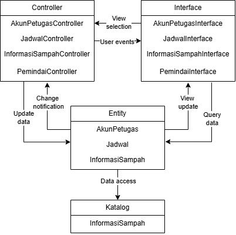

<h1>
IF2150 REKAYASA PERANGKAT LUNAK
 
TUGAS 6
 
ARSITEKTUR PERANGKAT LUNAK (APL)
</h1>
 

## EcoTrack

### Untuk: Agatha Tatianingseto

Dipersiapkan oleh:
| Informasi | Keterangan |
| --- | --- |
| Kelas | K2 |
| Kelompok | 5 |

| NIM | Nama |
|---|---|
| 13525038 | Mochammad Adhitya Nur Rohman |
| 13525068 | Kelvin Sebastian Yen |
| 13525086 | Arla Salsabila |
| 13525137 | Maharani Puan Satira |
| 13525146 | Muhammad Reffah |
---

 
 

# BAB 1: Style/Pattern Arsitektur Acuan

## 1.1 Style/Pattern yang Dipilih
*Style/pattern* yang dipilih pada PL EcoTrack yaitu MVC (*Model-View-Controller*). MVC merupakan salah satu pola arsitektur perangkat lunak yang dipakai dalam pengembangan aplikasi, khusunya berbasis web. Pola ini membagi aplikasi menjadi tiga komponen:
1. *Model* yang berfungsi untuk merepresentasikan data dan logika bisnis
2. *View* yang berfungsi sebagai komponen yang bertanggung jawab menampilkan data kepada pengguna (*interface*).
3. *Controller* yang berfungsi sebagai penghubung antara *Model* dan *View* 

## 1.2 Alasan Pemilihan
### 1.2.1 Kesesuaian dengan Karakteristik Sistem
MVC dipilih karena EcoTrack memiliki beberapa jenis pengguna dan fitur dengan antarmuka serta proses yang berbeda, seperti pemindaian sampah, pengelolaan jadwal, akses informasi sampah, dan autentikasi petugas. Pemisahan antara View, Controller, dan Model memungkinkan antarmuka, proses aplikasi, dan data dikelola secara terpisah sehingga tanggung jawab setiap komponen menjadi lebih jelas.

### 1.2.2 Kesesuaian dengan Kebutuhan Fungsional
Struktur MVC sesuai dengan kebutuhan fungsional EcoTrack karena setiap fitur dapat memiliki* nterface* sebagai View, *controller* sebagai pengolah proses, dan *entity* sebagai Model. Sebagai contoh, proses pengelolaan jadwal melibatkan Jadwal Interface untuk interaksi pengguna, Jadwal Controller untuk menangani proses pengelolaan, dan Jadwal untuk mengelola data jadwal. Pembagian ini juga dapat diterapkan pada fitur autentikasi, pemindaian sampah, dan informasi sampah.

## 1.3 Gambar style/pattern EcoTrack

<i>Gambar 1. Arsitektur MVC EcoTrack</i>

Tabel 1.1. Lingkungan Operasi Perangkat Lunak

Perangkat lunak menggunakan layanan server Firebase, dengan DBMS Firebase. Aplikasi client berbasis android, dan terhubung dengan model computer vision Roboflow.

| Komponen | Spesifikasi |
| :--- | :--- |
| Server | Firebase |
| Client | Aplikasi Android |
| DBMS | Firebase |
| OS | Aplikasi Android |
| Computer Vision | Roboflow |

Teknologi yang digunakan pada EcoTrack mendukung penerapan Model-View-Controller (MVC), dengan aplikasi Android sebagai lingkungan antarmuka (View), Firebase sebagai server dan DBMS yang mendukung pengelolaan data (Model), serta Roboflow sebagai computer vision model yang digunakan dalam proses pemindaian melalui Controller. Dengan demikian, teknologi tersebut mendukung pembagian tanggung jawab antara View, Controller, dan Model pada EcoTrack.

---

# BAB 2: Identifikasi Komponen / Modul / Subsistem

Pada bagian ini, lakukan identifikasi terhadap komponen, modul, atau subsistem yang menyusun aplikasi berdasarkan *pattern* arsitektur yang telah ditetapkan sebelumnya. Setiap komponen memiliki tanggung jawab tertentu dalam mendukung fungsionalitas sistem.

Setiap komponen memiliki tanggung jawab tertentu dalam mendukung fungsionalitas sistem secara keseluruhan. Komponen dapat dikelompokkan berdasarkan lapisan arsitektur (misalnya *Model*, *View*, dan *Controller* pada pattern MVC), atau berdasarkan fungsi atau peran komponen di dalam sistem (misalnya modul autentikasi, manajemen data, dan integrasi eksternal).

Tabel 2.1. Identifikasi Komponen/Modul/Subsistem

| Nama Komponen/Modul/Subsistem | Jenis                 | Penjelasan                                                                                                           |
| :---------------------------- | :-------------------- | :------------------------------------------------------------------------------------------------------------------- |
| *KatalogView*                 | *View*                | *Menampilkan daftar produk dan meneruskan aksi pelanggan (misalnya "Tambah ke Keranjang") ke KatalogController.*     |
| *KeranjangView*               | *View*                | *Menampilkan isi keranjang pelanggan beserta tombol checkout.*                                                       |
| *CheckoutView*                | *View*                | *Menampilkan ringkasan pesanan dan pilihan metode pembayaran kepada pelanggan.*                                      |
| *RiwayatPesananView*          | *View*                | *Menampilkan daftar pesanan yang pernah dibuat pelanggan beserta statusnya.*                                         |
| *KatalogController*           | *Controller*          | *Memproses permintaan daftar produk dan penambahan produk ke keranjang.*                                             |
| *KeranjangController*         | *Controller*          | *Memproses perubahan isi keranjang dan membuat pesanan baru saat checkout.*                                          |
| *PembayaranController*        | *Controller*          | *Memproses pemilihan metode pembayaran dan meneruskan permintaan otorisasi ke PaymentGatewayAdapter.*                |
| *PesananController*           | *Controller*          | *Memproses permintaan riwayat pesanan milik pelanggan.*                                                              |
| *Produk*                      | *Model*               | *Merepresentasikan data produk beserta stoknya serta metode untuk mengakses dan mengubahnya.*                        |
| *Keranjang*                   | *Model*               | *Merepresentasikan item yang dipilih pelanggan sebelum checkout serta metode untuk mengakses dan mengubahnya.*       |
| *Pesanan*                     | *Model*               | *Merepresentasikan data pesanan beserta status pembayarannya serta metode untuk mengakses dan mengubahnya.*          |
| *Pelanggan*                   | *Model*               | *Merepresentasikan data akun pelanggan serta metode untuk mengakses dan mengubahnya.*                                |
| *Validasi*                    | *Pendukung*           | *Memvalidasi input pelanggan sebelum diproses oleh controller.*                                                      |
| *PaymentGatewayAdapter*       | *Integrasi Eksternal* | *Mengirim permintaan otorisasi ke payment gateway (dummy) dan meneruskan status pembayaran ke PembayaranController.* |
| *Database*                    | *Penyimpanan Data*    | *Menyimpan seluruh data model secara persisten, baik lokal (misalnya SQLite) maupun terpusat (misalnya Supabase).*   |
| *...*                         | *...*                 | *...*                                                                                                                |

Ketentuan pengisian Tabel 2.1:
1. Kolom **Jenis** mengikuti pengelompokan pada *style/pattern* di BAB 1. Untuk MVC, jenisnya adalah *Model*, *View*, dan *Controller*. Jenis lain boleh ditambahkan, misalnya *Pendukung* untuk komponen bantu yang dipakai bersama, atau *Integrasi Eksternal* untuk penghubung ke sistem di luar P/L yang disebutkan pada subbab 2.2 dokumen SKPL. Kolom ini juga boleh diisi dengan *Subsistem*, *Modul*, atau *Komponen* apabila komponen dikelompokkan berdasarkan fungsinya. Tuliskan subsistem terlebih dahulu, lalu komponen penyusunnya di baris-baris berikutnya.
2. Komponen **tidak sama dengan** kelas. Satu komponen boleh mewadahi beberapa kelas dari diagram kelas pada dokumen SKPL. Pastikan seluruh kelas tercakup oleh setidaknya satu komponen.
3. Pastikan seluruh use case pada dokumen SKPL dapat dijalankan oleh komponen-komponen yang didaftarkan di tabel ini. Jangan menambahkan komponen untuk fitur yang tidak ada di SKPL.

<b><i>Catatan</i></b>: <i>Nama komponen pada Tabel 2.1 harus dipakai sama persis pada gambar di BAB 1 dan setiap view di BAB 3. Jika saat membuat view ternyata dibutuhkan komponen baru, tambahkan komponen tersebut ke Tabel 2.1 terlebih dahulu.</i>

---

# BAB 3: Model Arsitektur Perangkat Lunak

*Architectural View* adalah bagaimana cara kita melihat/mendeskripsikan arsitektur sebuah sistem dari sudut pandang tertentu. Dalam perancangan arsitektur aplikasi, dibutuhkan *Architectural View* yang dapat mempermudah pemahaman dari proses aplikasi yang akan dikembangkan. Tujuan dari *Architectural View* adalah menjadi bahan komunikasi, pemisahan masalah, mempermudah analisis, dan pemandu saat eksekusi pengembangan sistem tersebut.

Buatlah model arsitektur dari aplikasi yang akan dirancang dalam bentuk *view*. Model arsitektur ini berfungsi untuk memperlihatkan bagaimana setiap komponen, modul, dan subsistem saling berinteraksi serta berkolaborasi dalam menjalankan fungsi utama sistem secara keseluruhan. Anda dapat membuat satu atau lebih *view* tergantung kebutuhan dalam bentuk gambar. Pilihlah notasi yang sesuai. Contoh *view* yang dapat digunakan antara lain ***Logical View***, ***Process View***, ***Development View***, serta ***Physical View***.

Ketentuan pengisian BAB 3:
1. Setiap view menggambarkan **keseluruhan sistem**, bukan satu use case atau satu fitur saja.
2. Buat **minimal satu view**. Setiap view dituliskan dalam subbab tersendiri (3.1, 3.2, dan seterusnya). Tidak perlu membuat keempat view, pilih yang paling membantu menjelaskan P/L Anda, lalu jelaskan alasan pemilihannya.
3. Setiap view harus **konsisten dengan BAB 2**. Seluruh komponen pada Tabel 2.1 harus muncul dengan nama yang sama, dan tidak boleh ada komponen pada view yang tidak terdaftar di Tabel 2.1.
4. Setiap view harus **mencerminkan style/pattern pada BAB 1**. Misalnya, jika memilih MVC, pembagian *Model*, *View*, dan *Controller* harus terlihat jelas pada diagram.
5. Jika membuat lebih dari satu view, setiap view harus menggambarkan sistem yang sama dari sudut pandang berbeda. View tambahan melengkapi view pertama, bukan mengulanginya.
6. Beri label pada setiap garis atau panah yang menghubungkan komponen agar hubungan antarkomponen dapat dipahami tanpa penjelasan tambahan.
7. Jika membuat *Physical View*, gambarkan lingkungan operasi pada Tabel 1.1.

## 3.1 XXX View

Tuliskan secara singkat mengenai model arsitektur perangkat lunak yang Anda pilih dan sertakan alasan mengapa model arsitektur tersebut cocok untuk aplikasi Anda.

<i>Gambar 2. Contoh Logical View pada P/L E-Commerce</i>

Gambar 2 adalah contoh *Logical View* dalam bentuk *block diagram*. Seluruh komponen pada Tabel 2.1 digambarkan dan dikelompokkan sesuai pola MVC (*View*, *Controller*, *Model*), ditambah komponen pendukung dan basis data. Sistem di luar P/L, seperti *Payment Gateway (dummy)*, digambarkan dengan garis putus-putus dan tidak perlu dimasukkan ke Tabel 2.1. Setiap garis diberi label: "Memanggil" untuk *View* yang memanggil *Controller*, "akses" untuk *Controller* yang mengakses *Model*, serta agregasi dan komposisi untuk hubungan antar-*Model*.

<b><i>Catatan</i></b>: <i>Ganti XXX dengan nama view yang dibuat, misalnya Logical View. Gambar 2 hanya contoh untuk P/L e-commerce, ganti dengan view milik kelompok Anda yang memuat seluruh komponen pada Tabel 2.1. Jenis view dan notasinya boleh berbeda dari contoh. Jika membuat view tambahan, lanjutkan pola 3.x ini (3.2, 3.3, dan seterusnya).</i>

---

# Referensi

- https://www.rumahweb.com/journal/mvc-adalah/

- Sommerville, I. (2016). *Software Engineering* (10th ed.). Pearson. Chapter 6: *Architectural Design*: [https://software-engineering-book.com/slides/](https://software-engineering-book.com/slides/)
- Diagram arsitektur: [https://www.drawio.com/](https://www.drawio.com/), [https://staruml.io/](https://staruml.io/)
