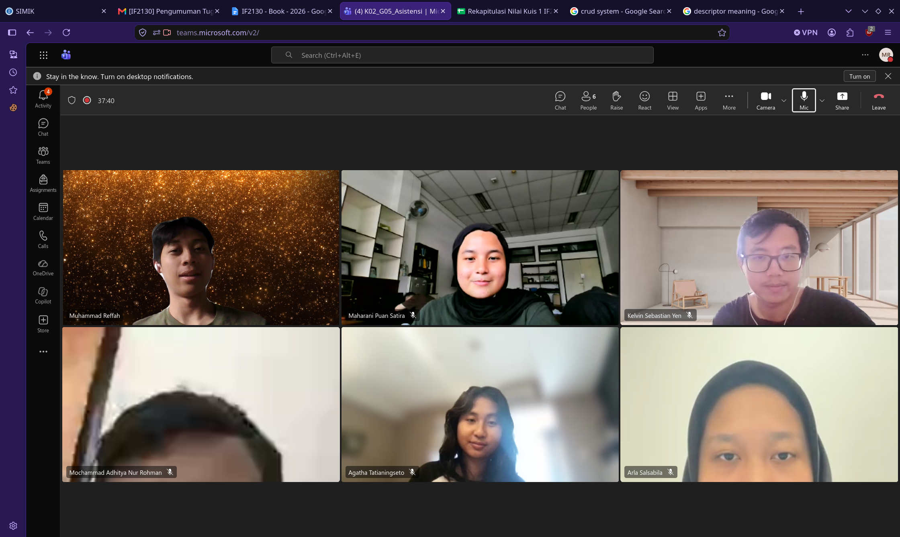

# Form Asistensi

## Tugas Besar IF2150 - Rekayasa Perangkat Lunak

| Informasi | Keterangan |
| --- | --- |
| **Hari** | Selasa |
| **Tanggal** | \[06/10/2026\] |
| **Kelas** | K2 |
| **Nomor Kelompok** | 5  |
| **Nama Kelompok** | Join yang mau |
| **Nama Perangkat Lunak** | EcoTrack |
| **Dokumen** | K02_G05_APL |

### Anggota Kelompok

| NIM | Nama |
|---|---|
| 13525038 | Mochammad Adhitya Nur Rohman |
| 13525068 | Kelvin Sebastian Yen |
| 13525086 | Arla Salsabila |
| 13525137 | Maharani Puan Satira |
| 13525146 | Muhammad Reffah |

### Catatan

| Catatan |
| --- |
| 1. Database punya logo sendiri (tabung) |
| 2. ⁠Interface gaboleh langsung manggil entity, interface cuman dari controller (lebih masalah safety) |
| 3. ⁠Katalog hapus |
| 4. ⁠Update data: entity ke database. Jelasin aja kata2 di panahnya. Controller ke entity minta acces ke entity biar bisa ke database. User events dari interface ke controller, dan view selection (ganti namanya: rendering content) dari controller ke interface |
| 5. ⁠Aplikasi ilangin di OS |
| 6. ⁠Bikin 2 buat view oke sih |

## Dokumentasi

<!--  -->

  

  <i>Gambar 1. Dokumentasi kegiatan asistensi.</i>

